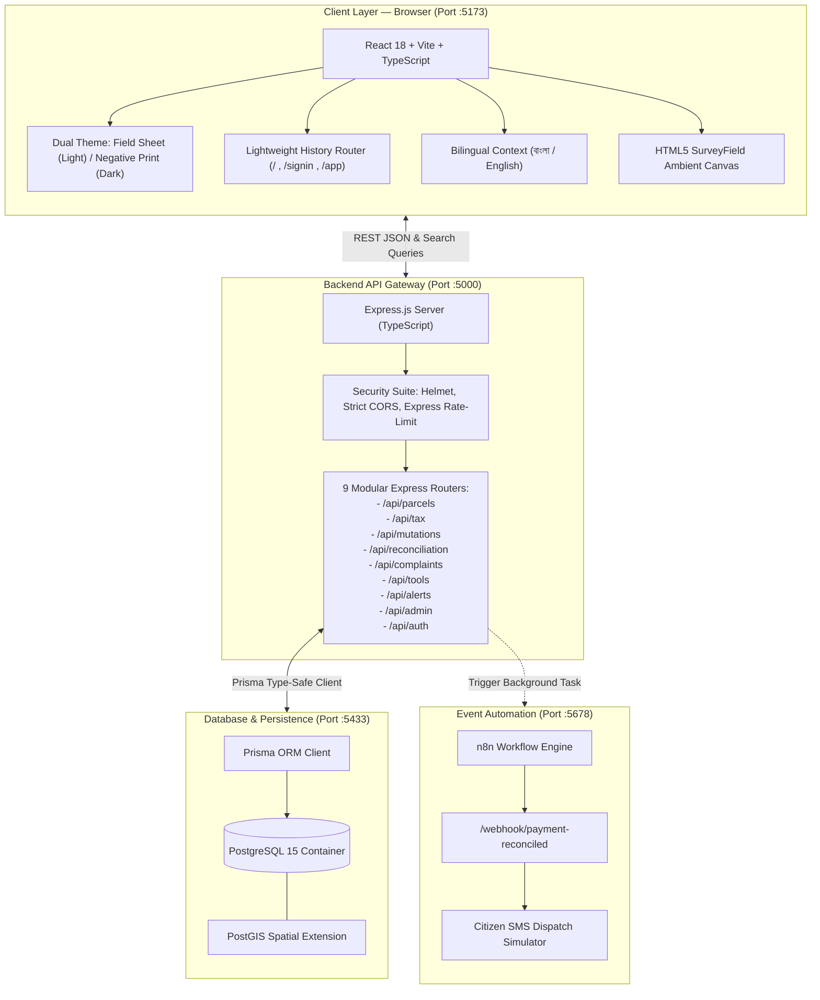
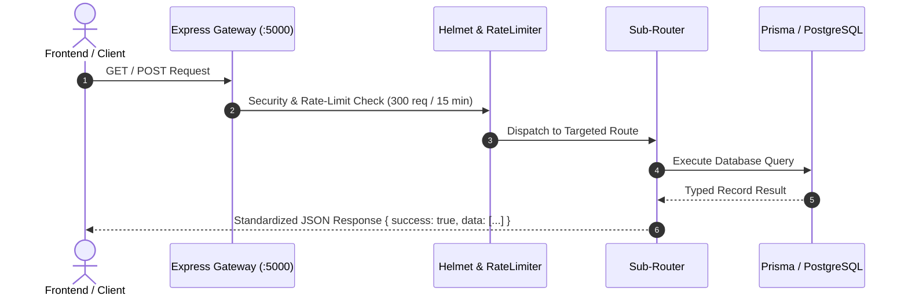
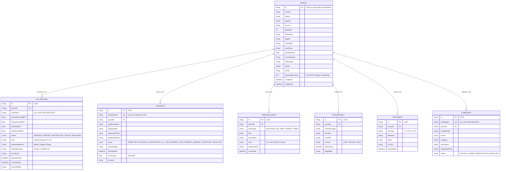
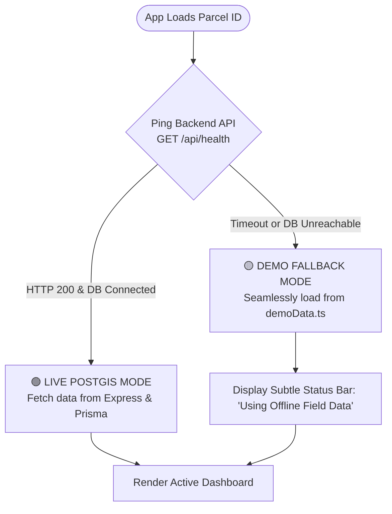

# 🇧🇩 Bangladesh Digital Land Platform — Existing System & Technical Inventory
### বর্তমান প্রকল্প কাঠামো, সক্রিয় মডিউল, এপিআই এবং ডাটাবেস বিবরণী (Current Codebase Audit)

| Metadata | Details |
|---|---|
| **Document Purpose** | Comprehensive Inventory & Architectural Documentation of Existing Features |
| **Workspace Path** | `c:\Users\Pritam\Downloads\land` |
| **Repository Stack** | React 18, Vite, TypeScript, Tailwind CSS, Express, Prisma ORM, PostGIS, n8n |
| **Design Language** | "Mouza Sheet" Cadastral Drafting Aesthetic (Anek Bangla + IBM Plex Mono) |
| **Document Version** | 1.0 — Current Codebase State |

---

## 📑 Table of Contents

1. [High-Level Technical Architecture](#1-high-level-technical-architecture)
2. [Frontend Architecture & Component System](#2-frontend-architecture--component-system)
3. [The 10 Interactive Dashboard Panels](#3-the-10-interactive-dashboard-panels)
4. [Specialized Modals & Interactive Tools](#4-specialized-modals--interactive-tools)
5. [Backend REST API Gateway Reference](#5-backend-rest-api-gateway-reference)
6. [Database Schema & Entity-Relationship Model (Prisma ORM)](#6-database-schema--entity-relationship-model-prisma-orm)
7. [Geospatial & Division Datasets Inventory](#7-geospatial--division-datasets-inventory)
8. [Automated Event Workflows (n8n Engine)](#8-automated-event-workflows-n8n-engine)
9. [Design System, Typography & Micro-Animations](#9-design-system-typography--micro-animations)
10. [Dual Data Mode: Live PostGIS vs. Zero-Crash Offline Layer](#10-dual-data-mode-live-postgis-vs-zero-crash-offline-layer)

---

## 1. High-Level Technical Architecture

The current project is a multi-tier, geospatial digital governance platform engineered to modernise land records, tax collection, cadastral inspection, and mutation processes in Bangladesh:



---

## 2. Frontend Architecture & Component System

The frontend is located in `/frontend/src` and is constructed with modular TypeScript components and zero-dependency custom routing.

```
frontend/src/
├── App.tsx                     # Top-level Router, LanguageProvider, SurveyField mount
├── main.tsx                    # React 18 DOM mount
├── index.css                   # "Mouza Sheet" design tokens & typography rules
├── components/
│   ├── ui.tsx                  # Buttons, StatusMarks, Badges, Toggles, Cards
│   ├── motion.tsx              # Line masks, Counter, TypedId animated components
│   ├── SurveyField.tsx         # Ambient HTML5 Canvas with drifting survey graticule
│   ├── ParcelPlate.tsx         # Self-drawing cadastral boundary vector component
│   ├── LeafletMap.tsx          # Real-time Leaflet map with GeoJSON polygons
│   ├── Modal.tsx               # Reusable backdrop-blurred accessible modal dialog
│   └── [10 Interactive Modals] # Specialized operational windows
├── lib/
│   ├── api.ts                  # REST API client + data source state manager
│   ├── demoData.ts             # Authoritative offline fallback dataset (855 lines)
│   ├── format.ts               # Taka currency, Decimals, dates, and Bangla digit utils
│   ├── gsap.ts                 # GSAP animation hooks with prefers-reduced-motion support
│   ├── language.tsx            # Full bilingual translation dictionary (EN / BN)
│   ├── router.tsx              # 60-line native History API router
│   ├── theme.ts                # Light ("Field Sheet") / Dark ("Negative Print") state
│   └── types.ts                # Strict TypeScript interface definitions
└── routes/
    ├── Landing.tsx             # Public portal with hero, record register & comparison
    ├── SignIn.tsx              # NID / Citizen / Officer / Admin credential entry
    ├── Dashboard.tsx           # Main workspace shell with search, tabs & status
    └── panels/                 # 10 dedicated functional workspace panels
```

---

## 3. The 10 Interactive Dashboard Panels

Located in `frontend/src/routes/panels/`, each panel represents a specialized administrative or citizen capability:

```mermaid
mindmap
  root((Dashboard Workspace))
    (1) Overview<br/>মালিকানা ও বিবরণ
    (2) Cadastral Map<br/>ডিএলআরএস জিআইএস নকশা
    (3) Chain of Lineage<br/>মালিকানা ধারাবাহিকতা
    (4) Due Diligence<br/>স্বত্ব পরীক্ষা ও অডিট
    (5) LD Tax & Dakhila<br/>ভূমি উন্নয়ন কর
    (6) e-Mutation<br/>ই-নামজারি ট্র্যাকার
    (7) Cross-Audit Checks<br/>বহুস্তরীয় সমন্বয়
    (8) Services Directory<br/>নাগরিক সেবা ডিরেক্টরি
    (9) Officer Workbench<br/>কর্মকর্তা এজলাস
    (10) Super Admin Center<br/>জাতীয় রাজস্ব ও নিয়ন্ত্রণ
```

### Detailed Breakdown of Each Panel:

| # | Panel | File | Bengali Title | Implemented Functionality |
|---|---|---|---|---|
| **1** | **Overview** | `Overview.tsx` | মালিকানা ও বিবরণ | Certified parcel metadata, NID/phone verification status, metric area conversion (Decimals $\leftrightarrow$ Sq Ft $\leftrightarrow$ Katha), quick status chips, and official record links. |
| **2** | **Cadastral Map** | `MapPanel.tsx` | ডিএলআরএস জিআইএস নকশা | Interactive Leaflet GIS vector map rendering WGS84 coordinates, adjacent plot boundaries, drone survey layer toggles, and corner station coordinates. |
| **3** | **Lineage** | `LineagePanel.tsx` | মালিকানা ধারাবাহিকতা | Chronological chain of title tracing ownership from CS (1920) $\to$ SA (1956) $\to$ RS (1978) $\to$ BS (2015) with deed references, sellers, and transfer types. |
| **4** | **Due Diligence** | `DueDiligencePanel.tsx` | স্বত্ব পরীক্ষা ও অডিট | Comprehensive 5-point title clearance audit checking encumbrances, litigation flags, boundary variances, and issuing a certified digital clearance certificate. |
| **5** | **LD Tax & Dakhila** | `TaxPanel.tsx` | ভূমি উন্নয়ন কর | Real-time tax demand calculation (annual demand + arrears), interactive payment gateway simulation (bKash/Nagad/Ekpay), and printable cryptographic Dakhila with QR code. |
| **6** | **e-Mutation** | `MutationsPanel.tsx` | ই-নামজারি ট্র্যাকার | Tracks 4 judicial hearing stages under AC (Land), logs hearing notices, and provides a multi-step mutation application wizard with DCR fee assessment (৳১,১৫০). |
| **7** | **Cross-Audit Checks** | `ChecksPanel.tsx` | বহুস্তরীয় সমন্বয় | Automated 4-way consistency audit checking e-Parcha, DLRS vector geometry, Sub-Registry deeds, and Upazila registers, highlighting boundary variances. |
| **8** | **Services Directory** | `ServicesPanel.tsx` | নাগরিক সেবা ডিরেক্টরি | Categorized index of national land services (Parcha application, Mouza map orders, Land zoning, Hotlines, Citizen Charter) with direct deep links. |
| **9** | **Officer Workbench** | `OfficerWorkbenchPanel.tsx` | সহকারী কমিশনার (ভূমি) এজলাস | Dedicated dashboard for AC (Land) & Kanungo revenue officers to review submitted mutation dockets, conduct hearings, and digitally sign judicial Order Sheets. |
| **10**| **Admin Center** | `SuperAdminDashboardPanel.tsx` | জাতীয় রাজস্ব কনসোল | High-level executive console displaying national tax recovery metrics, active officer directories, system audit logs, and land tax slab configuration. |

---

## 4. Specialized Modals & Interactive Tools

Located in `frontend/src/components/`, these modal dialogs provide in-depth workflows:

```mermaid
graph LR
    subgraph Modals ["10 Interactive Operational Modals"]
        M1["LandCalculatorModal<br/>(Unit Area Converter)"]
        M2["PaymentGatewayModal<br/>(bKash / Nagad / Ekpay)"]
        M3["MutationWizard<br/>(New Namjari Application)"]
        M4["DisputeModal<br/>(Grievance Filing)"]
        M5["LandLockModal<br/>(Property Anti-Fraud Lock)"]
        M6["AlertRadarModal<br/>(SMS Alert Simulator)"]
        M7["ClearanceCertificateModal<br/>(Printable Title Report)"]
        M8["OrderSheetModal<br/>(AC Land Court Hearing Signer)"]
        M9["DocumentViewerModal<br/>(Deed / Khatian / Dakhila PDF)"]
        M10["Modal.tsx<br/>(Accessible Dialog Primitive)"]
    end
```



- **`LandCalculatorModal`**: Live conversion across Decimal (*শতক*), Katha (*কাঠা*), Bigha (*বিঘা*), Acre (*একর*), Square Feet (*বর্গফুট*), and Square Meters (*বর্গমিটার*).
- **`PaymentGatewayModal`**: Realistic mobile financial service simulation supporting bKash, Nagad, Rocket, Upay, and Ekpay with live PIN input, validation, and auto-settlement.
- **`MutationWizard`**: 3-step citizen application capturing applicant credentials, transfer deed details, co-sharer declarations, and DCR payment agreement.
- **`LandLockModal`**: Citizen-controlled biometric freeze preventing unauthorized deeds or mutation applications from being registered against the parcel.
- **`AlertRadarModal`**: Simulates instant SMS alerts dispatched to the landowner whenever an inquiry or record access occurs.
- **`ClearanceCertificateModal`**: Generates a high-resolution, printable government Title Due Diligence Certificate with official QR verification code and watermarks.
- **`OrderSheetModal`**: Digital case order-sheet generator for revenue courts with hearing remarks and AC Land digital signature stamping.

---

## 5. Backend REST API Gateway Reference

The Express backend (`backend/src/server.ts`) runs on port `5000` with modular routing:



### Complete API Endpoint Catalog:

| Method | Endpoint | Router File | Description |
|---|---|---|---|
| `GET` | `/api/health` | `server.ts` | Probes API uptime and checks live PostgreSQL connection. |
| `GET` | `/api/parcels` | `routes/parcels.ts` | Searches and lists parcels by UPID, Khatian, Dag, Owner, NID, or Mouza. |
| `GET` | `/api/parcels/:parcelId` | `routes/parcels.ts` | Retrieves complete parcel record including tax, mutations, timeline, and documents. |
| `GET` | `/api/parcels/:parcelId/due-diligence` | `routes/parcels.ts` | Computes title clearance score and audits lineage, flags, and tax standing. |
| `GET` | `/api/tax/estimate` | `routes/tax.ts` | Dynamically estimates annual land development tax based on area and land classification. |
| `POST`| `/api/tax/pay` | `routes/tax.ts` | Settles pending tax demand, records transaction ID, and issues a certified digital Dakhila. |
| `GET` | `/api/tax/dakhila/:dakhilaNo` | `routes/tax.ts` | Verifies and retrieves official Dakhila record by receipt number. |
| `GET` | `/api/mutations` | `routes/mutations.ts` | Lists mutation cases, optionally filtered by parcel ID or case status. |
| `POST`| `/api/mutations` | `routes/mutations.ts` | Registers a new mutation application and assigns an AC Land case tracking number. |
| `PATCH`| `/api/mutations/:id/stage` | `routes/mutations.ts` | Advances mutation judicial hearing stage (Officer / AC Land role). |
| `POST`| `/api/reconciliation/run` | `routes/reconciliation.ts` | Runs automated cross-audit across e-Parcha, DLRS, and Sub-Registry records. |
| `GET` | `/api/complaints` | `routes/complaints.ts` | Lists citizen land boundary disputes and grievances. |
| `POST`| `/api/complaints` | `routes/complaints.ts` | Registers a new dispute tracking ticket and routes it to the local Union Land Office. |
| `GET` | `/api/alerts/recent` | `routes/alerts.ts` | Returns real-time property activity and SMS notifications. |
| `POST`| `/api/tools/convert-units` | `routes/tools.ts` | Backend metric unit conversion service. |
| `GET` | `/api/admin/metrics` | `routes/admin.ts` | Aggregates national revenue collection, active cases, and clearance rates. |
| `POST`| `/api/auth/login` | `routes/auth.ts` | Validates session for citizen, officer, or super-admin roles. |

---

## 6. Database Schema & Entity-Relationship Model (Prisma ORM)

Defined in `backend/prisma/schema.prisma`, the system models 7 core relational entities connected to parcels:



---

## 7. Geospatial & Division Datasets Inventory

The repository contains curated GeoJSON boundaries and land statistics:

### 1. Pre-Processed Khulna Division Data (`/external_divisions_data/Khulna/`):
- **`districts.geojson`**: MultiPolygon boundaries for all 10 districts in Khulna Division (Bagerhat, Chuadanga, Jashore, Jhenaidah, Khulna, Kushtia, Magura, Meherpur, Narail, Satkhira).
- **`upazilas.geojson`**: High-resolution Upazila boundary polygons for all 59 Upazilas.
- **`summary.json`**: Upazila and district level land statistics and count metrics.
- Subdirectories for each district containing local jurisdiction files.

### 2. National Divisional Data (`/New folder/`):
- **`land_data/`**: Raw division-level boundaries for Barishal, Chattogram, Dhaka, Sylhet.
- **`external_divisions_data/`**: Mymensingh, Rajshahi, Rangpur, and raw Humanitarian Data Exchange (`raw_hdx`) files.
- **`thematic_land_layers/`**: Thematic agricultural and urban land classification layers for Chattogram.

---

## 8. Automated Event Workflows (n8n Engine)

Located in `/n8n-workflows/payment_reconciliation.json`, the project includes an automated n8n workflow for financial settlement and citizen notifications:


---

## 9. Design System, Typography & Micro-Animations

As documented in `REDESIGN.md`, the platform abandons generic artificial intelligence dark-mode tropes in favor of the **"Mouza Sheet"** drafting aesthetic:

### Color Roles:
| Token Role | "Field Sheet" (Light Mode) | "Negative Print" (Dark Mode) | Usage Rationale |
|---|---|---|---|
| **Ground** | `#EFEFEA` (Drafting film) | `#0B0D0C` (Deep slate) | Ambient page canvas |
| **Surface** | `#FBFBF8` (Clean paper) | `#121514` (Elevation card) | Card backgrounds |
| **Ink** | `#14181A` (Black ink) | `#E9EBE6` (Off-white) | High-contrast typography |
| **Primary** | `#22456E` (Cadastral indigo) | `#86ADDA` (Muted cyan) | Primary actions & active tabs |
| **Seal** | `#A8322A` (Revenue red) | `#E07A70` (Coral red) | Arrears, objections, discrepancies |
| **State** | `#116149` (Government emerald)| `#4FBF95` (Mint green) | Certified records & completed taxes |

### Typography:
- **`Anek Bangla` & `Anek Latin`**: Superfamily by Ek Type ensuring unified baseline alignment across bilingual English and Bengali sentences without font clipping.
- **`IBM Plex Mono`**: Applied to UPID numbers, coordinates, survey bearings, and financial amounts for crisp tabular alignment.

### Animated Elements:
- **`ParcelPlate`**: Self-drawing SVG vector boundary that surveys its perimeter using `pathLength` animation before dropping corner survey stations.
- **`SurveyField`**: HTML5 Canvas rendering a slow-drifting geographic graticule with periodic survey sweeps every 14 seconds.
- **`TypedId`**: Character-by-character animated typing effect for parcel UPIDs with blinking terminal cursor.

---

## 10. Dual Data Mode: Live PostGIS vs. Zero-Crash Offline Layer

To ensure demonstrations never fail due to local database outages, the frontend has a **Dual Data Mode** managed in `frontend/src/lib/api.ts`:



- **Live Mode**: When Docker PostGIS and Express are running, all reads, tax payments, complaints, and mutation stages are persisted directly to PostgreSQL.
- **Offline Fallback Mode**: When the backend is offline, the app falls back to `demoData.ts` (855 lines of rich sample parcels), allowing all 10 panels, map vector overlays, unit converters, and modal workflows to function flawlessly.

---

## 11. Summary

The project is already an **exceptionally well-crafted, functional, and visually distinctive prototype**. It possesses a full frontend UI, working REST endpoints, rich GeoJSON geospatial boundaries, an authentic "Mouza Sheet" design language, and zero-crash offline resiliency.

Combined with the upgrade specifications detailed in **[PROJECT_IMPROVEMENT_BLUEPRINT.md](file:///c:/Users/Pritam/Downloads/land/PROJECT_IMPROVEMENT_BLUEPRINT.md)**, this codebase provides the ideal foundation to become the definitive national land operating platform for Bangladesh.
