# 🇧🇩 Bangladesh Digital Land Platform — Comprehensive Features & Capabilities Specification
### গণপ্রজাতন্ত্রী বাংলাদেশ সরকার — জাতীয় ভূমি তথ্য ও ব্যবস্থাপনা অটোমেশন প্ল্যাটফর্ম (iLMIS 2026+)

| Metadata | Details |
|---|---|
| **Document Title** | Platform Features & Technical Capabilities Master Specification |
| **System Name** | Bangladesh Digital Land Management & Cadastral Automation Platform (ভূমি সেবা) |
| **Target Architecture** | 3-Tier Integrated Land Management Information System (iLMIS) |
| **Technology Stack** | React 18, Vite, TypeScript, Tailwind CSS, GSAP, Leaflet, Node.js/Express, Prisma ORM, PostGIS, n8n |
| **Design Language** | "Mouza Sheet" Cadastral Drafting Aesthetic (Anek Bangla + IBM Plex Mono) |
| **Version** | 4.5 — Comprehensive Master Edition |
| **Workspace Path** | `c:\Users\Pritam\Downloads\landupdate` |

---

## 📑 Table of Contents

1. [Executive Summary & System Vision](#1-executive-summary--system-vision)
2. [Macro System Architecture](#2-macro-system-architecture)
3. [User Personas & Role-Based Access Control (RBAC)](#3-user-personas--role-based-access-control-rbac)
4. [The 10 Interactive Dashboard Workspace Panels](#4-the-10-interactive-dashboard-workspace-panels)
   - [4.1 Panel 1: Overview (মালিকানা ও বিবরণ)](#41-panel-1-overview-মালিকানা-ও-বিবরণ)
   - [4.2 Panel 2: Cadastral Map & BDS 2026 GIS (ডিএলআরএস জিআইএস নকশা)](#42-panel-2-cadastral-map--bds-2026-gis-ডিএলআরএস-জিআইএস-নকশা)
   - [4.3 Panel 3: Chain of Lineage (মালিকানা ধারাবাহিকতা)](#43-panel-3-chain-of-lineage-মালিকানা-ধারাবাহিকতা)
   - [4.4 Panel 4: Due Diligence & Title Forensics (স্বত্ব পরীক্ষা ও অডিট)](#44-panel-4-due-diligence--title-forensics-স্বত্ব-পরীক্ষা-ও-অডিট)
   - [4.5 Panel 5: LD Tax & Dakhila (ভূমি উন্নয়ন কর)](#45-panel-5-ld-tax--dakhila-ভূমি-উন্নয়ন-কর)
   - [4.6 Panel 6: e-Mutation (ই-নামজারি ট্র্যাকার ও আবেদন)](#46-panel-6-e-mutation-ই-নামজারি-ট্র্যাকার-ও-আবেদন)
   - [4.7 Panel 7: Multi-Source Cadastral Cross-Audit & Reconciliation (বহুস্তরীয় সমন্বয়)](#47-panel-7-multi-source-cadastral-cross-audit--reconciliation-বহুস্তরীয়-সমন্বয়)
   - [4.8 Panel 8: Services Directory (নাগরিক সেবা ডিরেক্টরি)](#48-panel-8-services-directory-নাগরিক-সেবা-ডিরেক্টরি)
   - [4.9 Panel 9: AC Land & Kanungo Officer Workbench (সহকারী কমিশনার ভূমি এজলাস)](#49-panel-9-ac-land--kanungo-officer-workbench-সহকারী-কমিশনার-ভূমি-এজলাস)
   - [4.10 Panel 10: Super Admin National Center (জাতীয় রাজস্ব কনসোল)](#410-panel-10-super-admin-national-center-জাতীয়-রাজস্ব-কনসোল)
5. [The 14 Specialized Interactive Modals & Operational Tools](#5-the-14-specialized-interactive-modals--operational-tools)
6. [Bhumi Sahayak (ভূমি সহায়ক) — AI Legal & Cadastral Intelligence](#6-bhumi-sahayak-ভূমি-সহায়ক--ai-legal--cadastral-intelligence)
7. [Algorithmic Deed Forensics & Anti-Fraud Engine](#7-algorithmic-deed-forensics--anti-fraud-engine)
8. [Zero-Trust Land Buy/Sell Escrow Financial Pipeline](#8-zero-trust-land-buysell-escrow-financial-pipeline)
9. [Faraiz Succession & Inheritance Apportionment Engine](#9-faraiz-succession--inheritance-apportionment-engine)
10. [Field Cadastral Survey, Offline Amin Suite & 4D Drone Cadastre](#10-field-cadastral-survey-offline-amin-suite--4d-drone-cadastre)
11. [Government Khas Land & Vested Property Protection Radar](#11-government-khas-land--vested-property-protection-radar)
12. [Civil Court Land Litigation & Injunction Radar](#12-civil-court-land-litigation--injunction-radar)
13. [Backend REST API Gateway Reference (15 Modular Routers)](#13-backend-rest-api-gateway-reference-15-modular-routers)
14. [Database Architecture & Spatial Entity-Relationship Schema](#14-database-architecture--spatial-entity-relationship-schema)
15. [Automated Event Workflows & n8n CDC Integration](#15-automated-event-workflows--n8n-cdc-integration)
16. [Cadastral "Mouza Sheet" Design System & Bilingual Localization](#16-cadastral-mouza-sheet-design-system--bilingual-localization)
17. [Current Platform Capabilities vs. Traditional Government Portals](#17-current-platform-capabilities-vs-traditional-government-portals)

---

## 1. Executive Summary & System Vision

The **Bangladesh Digital Land Management & Cadastral Automation Platform** is a sovereign, parcel-centric digital governance ecosystem. It solves the fragmentation in Bangladesh land administration where citizens must navigate disconnected portals across separate ministries:
- **Sub-Registry Offices** (*Ministry of Law, Justice and Parliamentary Affairs*)
- **Settlement & AC (Land) Offices** (*Ministry of Land*)
- **Civil & Revenue Courts** (*Judiciary & Supreme Court*)
- **Geospatial Survey Layers** (*Directorate of Land Records and Surveys - DLRS*)

By shifting from an **identifier-centric mental model** (asking citizens for fragmented Khatian, Dag, or Holding numbers across different websites) to a **parcel-centric unified model** (One persistent UPID $\to$ One vector boundary $\to$ One title chain $\to$ One tax account $\to$ One judicial history), the platform eliminates jurisdictional blind spots, curtails bureaucratic delays, and systematically halts land fraud.

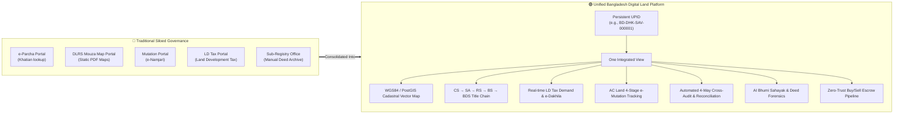

---

## 2. Macro System Architecture

The platform operates on a resilient 4-tier architecture featuring **zero-crash dual-mode data persistence**: when PostgreSQL/PostGIS is running, it queries live spatial SQL; if the database is offline or unseeded, it seamlessly falls back to an authoritative 855-line in-memory dataset (`demoData.ts`), ensuring uninterrupted operation in offline or remote field environments.

```mermaid
flowchart TB
    subgraph ClientTier ["1. Presentation Layer (Browser Port :5173)"]
        SPA["React 18 + Vite SPA"]
        ThemeEngine["Mouza Sheet Theme Engine<br/>(Field Sheet Light / Negative Print Dark)"]
        Router["Zero-Dependency History Router (/ , /signin , /app)"]
        LangProvider["Bilingual Provider (বাংলা / English)"]
        AmbientCanvas["HTML5 SurveyField Ambient Canvas"]
        SPA --> ThemeEngine & Router & LangProvider & AmbientCanvas
    end

    subgraph GatewayTier ["2. Backend API Gateway (Port :5000)"]
        Express["Express.js REST Gateway"]
        SecuritySuite["Helmet + Strict Whitelist CORS + Rate Limiter (300 req/15m)"]
        RouterHub["15 Modular Express Routers:
        • /api/auth             • /api/parcels
        • /api/payments         • /api/mutations
        • /api/reconciliation   • /api/complaints
        • /api/tools            • /api/alerts
        • /api/admin            • /api/assistant
        • /api/deed-verifier    • /api/escrow
        • /api/khas             • /api/survey
        • /api/drone"]
        Express --> SecuritySuite --> RouterHub
    end

    subgraph EngineTier ["3. Domain Engines & Core Services"]
        AiSvc["AiAssistantService (Gemini + Offline Legal Core)"]
        ForensicSvc["DeedVerifierService (Forensic Rule Engine)"]
        EscrowSvc["EscrowService (9-Stage Transaction Engine)"]
        FaraizSvc["FaraizService (Hanafi & Dayabhaga Engine)"]
        SurveySvc["SurveyService (Offline Cadastral Amin Suite)"]
        DroneSvc["DroneCadastreService (4D Cadastre Comparison)"]
        KhasSvc["KhasService (Government Land Defense)"]
        LitSvc["LitigationService (Civil Court Records)"]
        CryptoSvc["CryptoSignerService (Ed25519 Signatures)"]
    end

    subgraph DataTier ["4. Persistence & Automation Tier (Port :5433 & :5678)"]
        Prisma["Prisma ORM Client"]
        Postgres[("PostgreSQL 15")]
        PostGIS["PostGIS Spatial Engine (EPSG:4326 WGS84)"]
        n8n["n8n Workflow Automation Engine (:5678)"]
        Prisma --> Postgres --- PostGIS
        RouterHub -.->|Trigger Event Webhooks| n8n
    end

    ClientTier <-->|JSON REST & Search Queries| GatewayTier
    RouterHub <--> EngineTier
    EngineTier <--> DataTier
```

---

## 3. User Personas & Role-Based Access Control (RBAC)

The platform provides 5 distinct, tailor-made user personas configured in `frontend/src/routes/SignIn.tsx`, `backend/src/routes/auth.ts`, and `frontend/src/routes/Dashboard.tsx`:

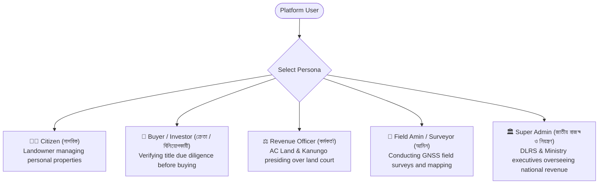

| Persona | Primary Needs & Default Landing Tab | Available Capabilities & Specialized Tools |
|---|---|---|
| **Citizen (নাগরিক)** | `Overview` / `LD Tax` | View certified records, pay LD Tax via bKash/Nagad, download cryptographic e-Dakhila, apply for e-Mutation, toggle biometric Land Lock, calculate Faraiz inheritance, file dispute grievances. |
| **Buyer / Investor (ক্রেতা / বিনিয়োগকারী)** | `Due Diligence` | Run 5-point title clearance audits, inspect civil court injunctions, screen deeds for forgery, initialize zero-trust buy/sell escrow, download official title clearance certificates. |
| **Revenue Officer (সহকারী কমিশনার ভূমি / কানুনগো)** | `Officer Workbench` | Review pending mutation dockets, conduct judicial hearings, generate and digitally sign Order Sheets, resolve multi-source discrepancies, review field Amin reports. |
| **Field Amin / Surveyor (আমিন)** | `Cadastral Map` | Access Leaflet GIS map with BDS 2026 vector layers, launch offline field survey modal, capture GPS station pegs, record neighbor boundary statements, calculate land area via Shoelace algorithm. |
| **Super Admin (জাতীয় নিয়ন্ত্রক)** | `Admin Center` | Monitor nationwide revenue collection, track mutation turnaround SLAs, manage AC Land / Kanungo officer workloads, configure land tax rate slabs, review audit logs. |

---

## 4. The 10 Interactive Dashboard Workspace Panels

Located in `frontend/src/routes/panels/`, the dashboard provides 10 dedicated operational workspaces:

### 4.1 Panel 1: Overview (মালিকানা ও বিবরণ)
- **File**: `frontend/src/routes/panels/Overview.tsx`
- **Core Features**:
  - **Certified Land Identity**: Displays authoritative Unique Parcel Identification (UPID, e.g., `BD-DHK-SAV-000001`), Mouza, JL Number, Dag No, Khatian No, and Holding No.
  - **Ownership & Verification**: Current owner name, NID verification chip, registered mobile number, and email.
  - **Metric Unit Converter Card**: Instant dynamic conversion between Decimal (*শতক*), Katha (*কাঠা*), Bigha (*বিঘা*), Square Feet (*বর্গফুট*), and Square Metres (*বর্গমিটার*).
  - **Status Indicators**: Real-time status chips indicating Title Clearance standing, Tax Dues status, and Biometric Land Lock state.
  - **Action Hub**: Direct access buttons for the Land Calculator, Dispute Grievance Filing, and Document Vault Viewer.

### 4.2 Panel 2: Cadastral Map & BDS 2026 GIS (ডিএলআরএস জিআইএস নকশা)
- **File**: `frontend/src/routes/panels/MapPanel.tsx`
- **Core Features**:
  - **Interactive Vector GIS**: Full Leaflet map rendering EPSG:4326 / WGS84 GeoJSON polygons with precise vertex coordinates.
  - **Multi-Layer Switching**:
    1. *BDS 2026 Drone GIS Vector* (PostGIS spatial boundary layer).
    2. *Satellite Orthophoto* (High-resolution aerial satellite composite basemap).
  - **Measurement & Drafting Tools**: Real-time interactive distance measurement ruler (feet/meters) and polygon perimeter calculation.
  - **Geodetic Coordinates & BTM**: Display of corner vertex latitude/longitude and BTM (Bangladesh Transverse Mercator) easting/northing coordinates.
  - **Adjacent Parcel Inspection**: Visual rendering of neighboring plots (North, South, East, West) with owner names and Dag numbers.
  - **Export & Print**: One-click GeoJSON export, boundary coordinate copying, and high-resolution official print preview.
  - **Specialized Launchers**: Direct buttons to open the **Offline Field Survey Modal** and the **4D Drone Cadastre Modal**.

### 4.3 Panel 3: Chain of Lineage (মালিকানা ধারাবাহিকতা)
- **File**: `frontend/src/routes/panels/LineagePanel.tsx`
- **Core Features**:
  - **Historical Survey Progression**: Traces unbroken title chain across all 5 historical survey epochs in Bangladesh history:
    - **CS (Cadastral Survey, 1924)**: British colonial base survey.
    - **SA (State Acquisition Survey, 1956)**: Post-Zamindari abolition records.
    - **RS (Revisional Survey, 1988)**: Modernized revision records.
    - **BS / City Survey (2015)**: High-density urban cadastral update.
    - **BDS (Bangladesh Digital Survey, 2026)**: Current RTK GNSS drone vector cadastre.
  - **Deed & Transfer Auditing**: Each node displays deed number, registration year, transfer type (*Saf-Kabla* purchase, *Heba* gift, *Faraiz* inheritance, or *e-Mutation*), and Sub-Registry jurisdiction.
  - **Lineage Integrity Score**: Automatic detection of missing parent deeds (*বায়া দলিল*) or irregular transfers.

### 4.4 Panel 4: Due Diligence & Title Forensics (স্বত্ব পরীক্ষা ও অডিট)
- **File**: `frontend/src/routes/panels/DueDiligencePanel.tsx`
- **Core Features**:
  - **5-Point Algorithmic Title Audit**:
    1. *Ownership & Identity Match* (NID and voter registry cross-check).
    2. *Cadastral Dag & Map Alignment* (BDS vector geometry vs. Khatian area).
    3. *Historical Lineage Continuity* (Unbroken chain from CS to BDS).
    4. *LD Tax Standing* (Current fiscal year clearance).
    5. *Encumbrance & Legal Cleanliness* (Court injunctions, stay orders, and mortgage liens).
  - **Title Clearance Score (0 to 100)**: Visual gauge with risk categorization (`APPROVED_FOR_TRANSACTION`, `CAUTION_REQUIRED`, or `DISPUTED_RESTRICTED`).
  - **Litigation Radar Section**: Highlights active civil court suits (Title Suit, Partition Suit, Temporary Injunction under Order 39 CPC) and stay order details.
  - **Government Khas Proximity Badge**: Real-time status showing proximity to government land or waterbodies.
  - **Operational Launchers**:
    - Launch **Algorithmic Deed Forensics Modal**.
    - Launch **Zero-Trust Buy/Sell Escrow Modal**.
    - Launch **Government Khas Radar Modal**.
    - Generate & Print **Official Title Due Diligence Clearance Certificate** with Ed25519 signature.

### 4.5 Panel 5: LD Tax & Dakhila (ভূমি উন্নয়ন কর)
- **File**: `frontend/src/routes/panels/TaxPanel.tsx`
- **Core Features**:
  - **Dynamic Demand Calculation**: Automatically assesses tax based on land classification (*Residential*, *Commercial*, or *Agricultural*), total decimal area, and applicable fiscal year.
  - **25-Bigha Agricultural Waiver**: Applies statutory agricultural exemption for holdings under 25 Bighas (825 decimals) under Government policy.
  - **Arrear & Surcharge Engine**: Calculates overdue arrears with statutory late payment surcharge multipliers.
  - **MFS Payment Gateway Simulation**: Deep integration with `PaymentGatewayModal` supporting bKash, Nagad, Rocket, Upay, and Ekpay.
  - **Cryptographic e-Dakhila (দাখিলা)**: Instant generation of the official government tax receipt containing:
    - Unique Dakhila number (e.g., `DAK-2026-849102`).
    - Fiscal year and payment transaction ID.
    - Official verification QR code linking to the verification endpoint.
    - High-resolution printable template conforming to Ministry of Land guidelines.

### 4.6 Panel 6: e-Mutation (ই-নামজারি ট্র্যাকার ও আবেদন)
- **File**: `frontend/src/routes/panels/MutationsPanel.tsx`
- **Core Features**:
  - **4-Stage Judicial Hearing Lifecycle Tracker**:
    1. `SUBMITTED`: Application filed with deed copies and NID.
    2. `KANUNGO_VERIFICATION`: Field inquiry by Union Land Assistant Officer (ULAO).
    3. `AC_LAND_HEARING`: Formal hearing under the Assistant Commissioner (Land) with notice to co-sharers.
    4. `DCR_PAYMENT_PENDING`: Payment of statutory Duplicate Carbon Receipt (DCR) fee (৳১,১৫০).
    5. `APPROVED`: Automated issuance of new certified Khatian.
  - **Interactive Mutation Wizard**: 3-step citizen application wizard capturing applicant info, registered deed details, co-sharer declarations, and fee commitment.
  - **Hearing Notice & Case History**: Chronological view of summons, spot inspection reports, and judicial remarks.

### 4.7 Panel 7: Multi-Source Cadastral Cross-Audit & Reconciliation (বহুস্তরীয় সমন্বয়)
- **File**: `frontend/src/routes/panels/ChecksPanel.tsx`
- **Core Features**:
  - **Automated 4-Way Cross-Audit**: Simultaneously inspects 4 independent government record repositories:
    1. *e-Parcha Digital Khatiyan* (DLRS record-of-rights).
    2. *DLRS Drone Vector Cadastre* (PostGIS spatial geometry).
    3. *Sub-Registry Deed Vault* (Law Ministry registered conveyances).
    4. *Upazila Holding Tax Register* (Ministry of Land revenue records).
  - **Discrepancy Engine**: Automatically detects:
    - *Area Discrepancies* (Differences between deed area and mapped polygon).
    - *Dag Number Misalignments* (Overlapping or duplicated plot numbers).
    - *Owner Name Spelling Inconsistencies*.
    - *Boundary Encroachments*.
  - **Severity Flagging & Resolution**: Flags variances as *Low*, *Medium*, or *High Risk* and provides an administrative resolution workflow.

### 4.8 Panel 8: Services Directory (নাগরিক সেবা ডিরেক্টরি)
- **File**: `frontend/src/routes/panels/ServicesPanel.tsx`
- **Core Features**:
  - **One-Stop Service Directory**: Direct portal links and explanations for:
    - Certified Khatian / Parcha application (*ই-পর্চা*).
    - Mouza map sheet postal delivery (*মৌজা নকশা*).
    - Land zoning and land-use inquiry (*ভূমি জোনিং*).
    - Land Revenue Case tracking (*ভূমি রাজস্ব মামলা*).
    - Ministry of Land 16122 24/7 Hotline support.
    - Citizen Charter (*নাগরিক সনদ*) and statutory service deadlines.
  - **Integrated Tool Launchers**: Direct access to Land Calculator, Faraiz Calculator, and Grievance Dispute filing.

### 4.9 Panel 9: AC Land & Kanungo Officer Workbench (সহকারী কমিশনার ভূমি এজলাস)
- **File**: `frontend/src/routes/panels/OfficerWorkbenchPanel.tsx`
- **Core Features**:
  - **Judicial Hearing Docket**: Filterable queue of mutation applications categorized by stage (*Field Inspection Pending*, *Hearing Scheduled*, *DCR Payment Pending*).
  - **Hearing Scheduler**: Schedule upcoming hearings and automatically dispatch simulated SMS summons to applicants and recorded co-sharers.
  - **Judicial Order Sheet Modal**: Allows the AC Land to draft formal rulings, cite relevant statutory sections of the State Acquisition and Tenancy Act 1950, and digitally sign the order.
  - **Discrepancy Remediation**: Interface to inspect flagged discrepancies and record official resolution findings.

### 4.10 Panel 10: Super Admin National Center (জাতীয় রাজস্ব কনসোল)
- **File**: `frontend/src/routes/panels/SuperAdminDashboardPanel.tsx`
- **Core Features**:
  - **National Revenue Intelligence**: Real-time aggregation of total land development tax collected vs. outstanding arrears across Bangladesh.
  - **Mutation Turnaround SLA Analytics**: Tracks average mutation completion times against the national SLA target (28 days).
  - **Division-Wise Distribution**: Granular metrics across all 8 administrative divisions (Dhaka, Chittagong, Rajshahi, Khulna, Barishal, Sylhet, Rangpur, Mymensingh).
  - **Revenue Officer Directory**: Active AC Land and Kanungo officers, officer status, and live pending queue counts with re-assignment capability.
  - **Tax Slab Policy Configuration**: Live administrative controls to tune residential, commercial, and agricultural tax rates per decimal and set late surcharges.
  - **System Audit Log**: Real-time event log tracking administrative interventions, logins, and parcel updates.

---

## 5. The 14 Specialized Interactive Modals & Operational Tools

Located in `frontend/src/components/`, these modular dialogs deliver deep, interactive workflows across the platform:

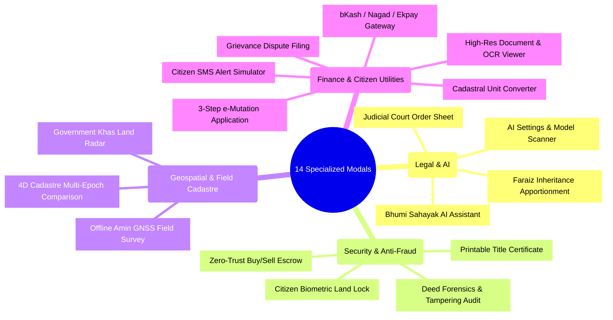

### Detailed Modal Specification:

| # | Modal Component | Primary Purpose & Features | Key Capabilities |
|---|---|---|---|
| **1** | **`BhumiSahayakWidget.tsx`** | AI Cadastral Legal Assistant | Bilingual conversational chat, persona toggle (Citizen/Officer), prompt suggestions, action deep-links, Gemini integration + sovereign offline fallback. |
| **2** | **`BhumiSahayakSettingsModal.tsx`** | AI Engine Configuration | Enter Google Gemini API key, live scan available Gemini models, set custom temperature, switch to sovereign offline mode. |
| **3** | **`DeedForensicsModal.tsx`** | Deed Tampering & Forgery Audit | Algorithmic analysis of 6 fraud vectors (Area inflation, Baya lineage, Deceased vendor NID, Sub-Registry jurisdiction, Valuation fairness, Court stay orders). Includes 4 interactive presets. |
| **4** | **`EscrowPipelineModal.tsx`** | Land Buy/Sell Financial Escrow | Guides buyer and seller through 9 stages: Offer $\to$ Land Lock $\to$ Escrow Deposit $\to$ Title Certification $\to$ Sub-Registry Deed Execution $\to$ Mutation Approval $\to$ Fund Disbursement. Computes all statutory taxes (Stamp duty, AIT, local gov). |
| **5** | **`FaraizCalculatorModal.tsx`** | Islamic & Hindu Estate Apportionment | Implements Hanafi rules (*Zawil-Furud*, *Asaba*, *Awl*, *Radd*) and Dayabhaga Hindu succession. Features an interactive SVG pie chart, fractional shares, and metric area conversion. |
| **6** | **`OfflineSurveyModal.tsx`** | Field Amin Cadastral Survey Suite | Works offline in remote mouzas. Logs GPS station pegs (BTM coordinates, elevation, chainage in links/feet, marker types), captures neighbor boundary statements, computes area via Shoelace formula, and syncs queue upon reconnecting. |
| **7** | **`DroneCadastreModal.tsx`** | 4D Cadastre Multi-Epoch Comparison | Compares polygon boundaries across 4 historical survey epochs (CS 1924, RS 1988, BS 2015, BDS 2026). Detects vertex shifts, area drift percentages, and illegal canal/waterbody encroachments. |
| **8** | **`KhasRadarModal.tsx`** | Government Khas Land Defense | Proximity radar auditing parcel boundaries against 1-No Khas, Vested Property, Riverbed/Foreshore (Sikasti/Payasti), and Forest reserves. Logs eviction notices and encroachment flags. |
| **9** | **`LandLockModal.tsx`** | Biometric Fraud Protection Freeze | Allows citizens to freeze their land record. When locked, Sub-Registry deeds and mutation filings are rejected until unlocked with biometric authentication. |
| **10**| **`PaymentGatewayModal.tsx`** | MFS Land Tax Settlement | High-fidelity simulation of bKash, Nagad, Rocket, Upay, and Ekpay. Realistic PIN entry, OTP verification, instant transaction ID generation, and automatic e-Dakhila creation. |
| **11**| **`ClearanceCertificateModal.tsx`**| Official Title Clearance Report | Generates an authentic government-formatted Title Due Diligence Clearance Certificate complete with official crest watermark, 5-point audit breakdown, Ed25519 signature, and QR code. |
| **12**| **`OrderSheetModal.tsx`** | AC Land Judicial Hearing Signer | Digital order-sheet generator for revenue court sessions. AC Land inputs case facts, legal rationale, passes rulings (Approve, Reject, Adjourn), and applies digital signature stamps. |
| **13**| **`LandCalculatorModal.tsx`** | Cadastral Unit Converter | Bi-directional unit conversion across Decimal, Katha, Bigha, Acre, Square Feet, and Square Metres with instant calculation and Bengali numeral formatting. |
| **14**| **`MutationWizard.tsx`** | 3-Step e-Mutation Application | Guided citizen application wizard capturing buyer/seller credentials, registered deed references, co-sharer declarations, and DCR payment agreement. |

---

## 6. Bhumi Sahayak (ভূমি সহায়ক) — AI Legal & Cadastral Intelligence

Located in `backend/src/services/aiAssistantService.ts`, `backend/src/routes/assistant.ts`, and `frontend/src/components/BhumiSahayakWidget.tsx`:

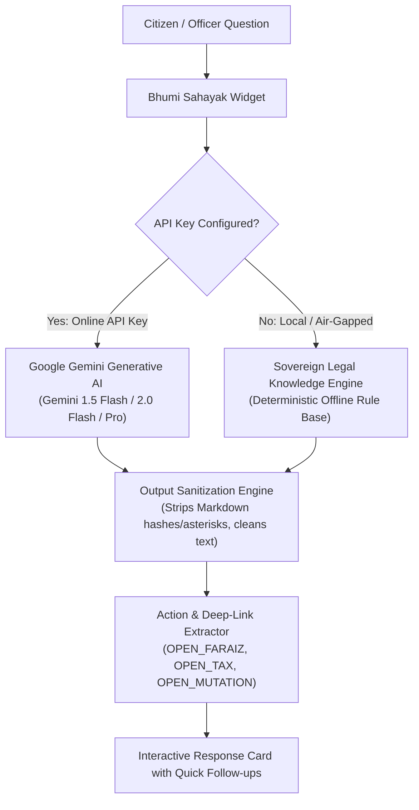

### Key Technical Capabilities:
1. **Hybrid Execution Engine**:
   - **Gemini API Integration**: Leverages Google Generative Language API (`gemini-1.5-flash`, `gemini-2.0-flash`, `gemini-1.5-pro`, `gemini-1.5-flash-8b`).
   - **Sovereign Offline Fallback**: 800+ lines of deterministic legal knowledge answering queries on e-Mutation fees, Faraiz principles, LD Tax policies, Khatian differences, and due diligence checks with zero external network dependencies.
2. **Live Model Scanner (`/api/assistant/models`)**: Connects to the Generative Language API to dynamically probe and catalog available models for the user's API key.
3. **Strict Text Sanitization**: Automated filter stripping distracting markdown formatting characters (`#`, `*`) and raw emojis, ensuring clean, authoritative government typography.
4. **Action Deep-Links**: Automatically analyzes query intent and renders actionable shortcut buttons inside the chat (e.g., clicking *"Open Faraiz Calculator"* opens the inheritance modal pre-loaded with parcel data).
5. **Persona Alignment**: Responds with citizen-friendly explanations in Citizen mode, and cites specific legal statutory sections (e.g., *State Acquisition and Tenancy Act 1950, Sec 143*) in Officer mode.

---

## 7. Algorithmic Deed Forensics & Anti-Fraud Engine

Implemented in `backend/src/services/deedVerifier.ts`, `backend/src/routes/deedVerifier.ts`, and `frontend/src/components/DeedForensicsModal.tsx`:

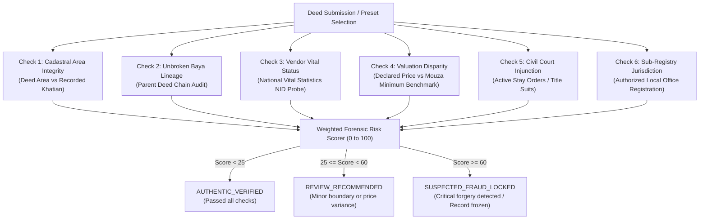

### The 4 Interactive Test Presets:
1. **Clean Conveyance Deed (*বৈধ সাফ-কবলা দলিল*)**: Verified living seller, authentic parent deed, declared price matching government rate, exact area match $\to$ `AUTHENTIC_VERIFIED`.
2. **Area Inflation Forgery (*অতিরিক্ত জমি দাবি জালিয়াতি*)**: Deed fraudulently claims 9.20 decimals on a parcel where only 5.50 decimals exist in the Khatian $\to$ `SUSPECTED_FRAUD_LOCKED` (Area inflation violation).
3. **Deceased Vendor Impersonation (*মৃত ব্যক্তির ভুয়া বিক্রেতা সাজানো*)**: Seller NID matches a deceased individual in national vital statistics $\to$ `SUSPECTED_FRAUD_LOCKED` (Identity impersonation fraud).
4. **Civil Injunction Violation (*আদালতের স্থগিতাদেশ লঙ্ঘন*)**: Seller attempts to sell land subject to an active Senior Assistant Judge Court stay order $\to$ `SUSPECTED_FRAUD_LOCKED` (Contempt of court / Lis Pendens violation).

---

## 8. Zero-Trust Land Buy/Sell Escrow Financial Pipeline

Implemented in `backend/src/services/escrowService.ts`, `backend/src/routes/escrow.ts`, and `frontend/src/components/EscrowPipelineModal.tsx`:

Eliminates the traditional risk of cash fraud, double-selling, and deed registration without payment by holding buyer funds in an authorized escrow account until title transfer and mutation are completed.

```mermaid
stateDiagram-v2
    [*] --> OFFER_PENDING: Buyer submits purchase contract offer
    OFFER_PENDING --> LAND_LOCKED: Seller accepts; Biometric Land Lock automatically engaged
    LAND_LOCKED --> ESCROW_DEPOSITED: Buyer deposits earnest & balance funds into Escrow Bank Vault
    ESCROW_DEPOSITED --> TITLE_AUDITED: Automated Deed Forensics & Court Injunction Clearance
    TITLE_AUDITED --> SUB_REGISTRY_SCHEDULED: Biometric deed execution appointment scheduled
    SUB_REGISTRY_SCHEDULED --> DEED_EXECUTED: Saf-Kabla deed officially registered at Sub-Registry
    DEED_EXECUTED --> MUTATION_RECORDED: AC Land issues approved e-Mutation and new Khatian
    MUTATION_RECORDED --> FUNDS_RELEASED: Escrow automatically disburses net funds to seller account
    FUNDS_RELEASED --> [*]
```

### Statutory Tax Assessment Breakdown:
The engine automatically calculates statutory transfer fees and deducts them from the consideration:
- **Stamp Duty**: 1.5% of total deed value.
- **Local Government Tax**: 2.0% (Union Parishad / Municipality).
- **Registration Fee**: 1.0% (Registration Directorate).
- **Source Tax (AIT / Sec 53H)**: 3.0% - 5.0% depending on municipal classification.
- **Net Payout**: Consideration amount minus statutory fees automatically disbursed to the seller's verified bank routing number upon mutation completion.

---

## 9. Faraiz Succession & Inheritance Apportionment Engine

Implemented in `backend/src/services/faraizService.ts`, `backend/src/routes/tools.ts`, and `frontend/src/components/FaraizCalculatorModal.tsx`:

An authoritative personal law apportionment calculator designed specifically for Bangladesh land administration, resolving inheritance boundary conflicts.

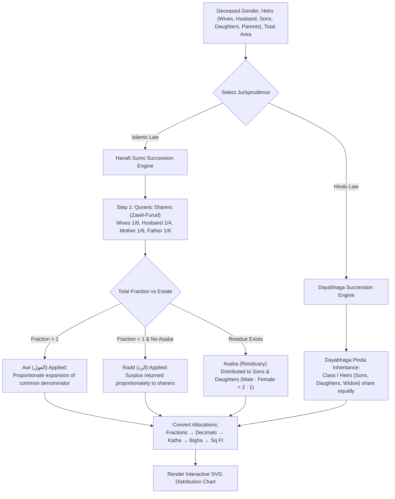

### Mathematical & Legal Highlights:
- **Zawil-Furud (*কুরআনিক অংশীদার*)**: Accurately computes fixed legal shares for spouses, parents, and direct heirs.
- **Asaba (*অবশিষ্টভোগী*)**: Allocates residue among sons and daughters using the Quranic 2:1 rule.
- **Awl (*আউল*)**: Handles estate deficits by expanding denominators to ensure all legal sharers receive proportional allocations.
- **Radd (*রদ্দ*)**: Handles estate surpluses in the absence of residuaries by returning excess property to Quranic sharers.
- **Dayabhaga Hindu Succession (*দায়ভাগ হিন্দু উত্তরাধিকার আইন*)**: Supports Hindu succession rules practiced in Bangladesh, apportioning equal shares among widow and direct heirs.

---

## 10. Field Cadastral Survey, Offline Amin Suite & 4D Drone Cadastre

Implemented in `backend/src/services/surveyService.ts`, `backend/src/services/droneCadastreService.ts`, `frontend/src/components/OfflineSurveyModal.tsx`, and `frontend/src/components/DroneCadastreModal.tsx`:

### 10.1 Offline Amin GNSS Field Cadastre
Engineered for remote rural mouzas where cellular data is unavailable:
- **GPS Peg Capture**: Records benchmark station pegs with Latitude/Longitude, BTM Easting/Northing, elevation in meters, marker type (*Concrete Pillar*, *Iron Rod*, *Boundary Stone*), and chainage to next peg in both **Gunter's links** (*লিংক*) and **feet**.
- **Shoelace Polygon Area Computation**: Dynamically calculates enclosed polygon area in square feet and decimals from station coordinates.
- **Variance Analysis**: Compares surveyed physical land area against recorded Khatian area, flagging variances exceeding 0.05 decimals.
- **Neighbor & Co-Sharer Statements**: Digital log capturing statements, NIDs, and boundary dispute objections from adjacent plot owners on-site.
- **IndexedDB / Local Offline Queue**: Stores survey sessions in browser storage when disconnected and synchronizes batch records (`/api/survey/sync`) upon reconnecting.

### 10.2 4D Drone Cadastre Multi-Epoch Analysis
Compares cadastral vector boundaries across 4 distinct survey epochs:
- **CS 1924** (Cadastral Survey — Plane table drafting)
- **RS 1988** (Revisional Survey — Theodolite traverse)
- **BS 2015** (Bangladesh Survey — Total station EDM)
- **BDS 2026** (Bangladesh Digital Survey — RTK GNSS Drone Vector)

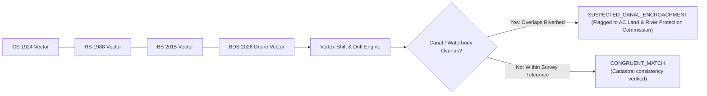

---

## 11. Government Khas Land & Vested Property Protection Radar

Implemented in `backend/src/services/khasService.ts`, `backend/src/routes/khas.ts`, and `frontend/src/components/KhasRadarModal.tsx`:

Defends government land, riverbeds (*পয়স্তি ও সিকস্তি*), and vested properties from private grabbing and illegal registration:
- **National Khas Inventory**: Catalogs Government 1-No Khas (*১নং খাস খতিয়ান*), Vested Property (*অর্পিত সম্পত্তি*), Abandoned Property (*পরিত্যক্ত সম্পত্তি*), Riverbeds (*নদী ও ফোরশোর*), and Forest Reserves.
- **Spatial Proximity Engine**: Computes Euclidean/geodesic distance between parcel centroid and known government parcels.
- **Risk Categorization**:
  - `CRITICAL_ENCROACHMENT`: Direct polygon boundary overlap with government land $\to$ immediate registration block.
  - `BUFFER_WARNING`: Parcel is within a 50-meter safety buffer of a canal, riverbed, or forest reserve.
  - `CLEAN`: Safe distance from any protected government assets.
- **Eviction Notice Dispatcher**: Allows revenue officers to register administrative eviction dockets and log formal notice dates under the *Public and Local Authorities Lands and Buildings (Recovery of Possession) Ordinance 1970*.

---

## 12. Civil Court Land Litigation & Injunction Radar

Implemented in `backend/src/services/litigationService.ts` and `frontend/src/routes/panels/DueDiligencePanel.tsx`:

Connects land parcels with civil court dispute records to prevent the sale of disputed property:
- **Civil Suit Types Tracked**:
  - *Title Suit* (স্বত্ব মামলা)
  - *Partition Suit* (বণ্টন মামলা)
  - *Temporary Injunction* (অস্থায়ী নিষেধাজ্ঞা under Order 39, Civil Procedure Code)
  - *Lis Pendens* (Sec 52, Transfer of Property Act 1882)
- **Stay Order Radar**: Instantly flags parcels with active stay orders, displaying issuing court name (*Senior Assistant Judge Court, Savar*), case number, date granted, and next hearing date.
- **Automated Title Lock**: If an active injunction is confirmed, the parcel's Title Clearance score is set to `DISPUTED_RESTRICTED` and Deed Forensics flags any conveyance attempt as high risk.

---

## 13. Backend REST API Gateway Reference (15 Modular Routers)

The Express backend (`backend/src/server.ts`) runs on port `5000` with modular routing, Helmet security, CORS whitelisting, and rate limiting (300 requests / 15 minutes):

```
backend/src/routes/
├── admin.ts           # Executive metrics, officer queues, tax rate policies
├── alerts.ts          # Recent property activity and citizen SMS alerts
├── assistant.ts       # Bhumi Sahayak AI chat, Gemini model scanning, prompts
├── auth.ts            # RBAC login, token verification, session management
├── complaints.ts      # Citizen dispute grievances and tracking tickets
├── deedVerifier.ts    # Algorithmic deed forensic audit and test presets
├── drone.ts           # Cadastral survey epochs & multi-epoch comparison
├── escrow.ts          # Zero-trust land buy/sell escrow pipeline & payouts
├── khas.ts            # Government Khas land records & encroachment checks
├── mutations.ts       # e-Mutation application, docket queue, stage advancements
├── parcels.ts         # Parcel lookup, full records, due diligence scoring, locks
├── reconciliation.ts  # 4-way cross-audit reconciliation engine execution
├── survey.ts          # Field survey sessions, station pegs, statements, offline sync
├── tax.ts             # LD Tax estimation, MFS payment settlement, e-Dakhila lookup
└── tools.ts           # Unit conversion, Faraiz calculation, Ed25519 signing
```

### Complete API Endpoint Catalog:

| Method | Route | Description |
|---|---|---|
| `GET` | `/api/health` | Health probe checking database connectivity and service status. |
| `POST` | `/api/auth/login` | Authenticates citizen, officer, buyer, amin, or admin session. |
| `GET` | `/api/parcels` | Searches parcels by UPID, Khatian, Dag, Owner, NID, or Mouza. |
| `GET` | `/api/parcels/:id` | Returns complete parcel record (tax, mutations, timeline, documents). |
| `GET` | `/api/parcels/:id/due-diligence` | Calculates 5-point due diligence score and generates verification report. |
| `POST` | `/api/parcels/:id/lock` | Toggles citizen biometric Land Lock anti-fraud freeze. |
| `POST` | `/api/payments/pay-tax` | Settles LD Tax demand, records transaction ID, and generates e-Dakhila. |
| `GET` | `/api/payments/dakhila/:dakhilaNo` | Verifies and retrieves official e-Dakhila receipt record. |
| `GET` | `/api/mutations` | Lists mutation dockets filtered by parcel ID or case status. |
| `POST` | `/api/mutations` | Submits a new e-Mutation application and assigns case tracking number. |
| `PATCH`| `/api/mutations/:id/stage` | Advances judicial hearing stage (Officer / AC Land role). |
| `POST` | `/api/reconciliation/run` | Executes 4-way cadastral cross-audit across e-Parcha, DLRS, and Deeds. |
| `GET` | `/api/complaints` | Lists citizen land grievances and boundary disputes. |
| `POST` | `/api/complaints` | Submits a new dispute ticket routed to the local Union Land Office. |
| `POST` | `/api/assistant/chat` | Conversational query endpoint for Bhumi Sahayak AI Assistant. |
| `POST` | `/api/assistant/models` | Probes available Google Gemini models for given API key. |
| `GET` | `/api/assistant/suggestions` | Retrieves default prompt suggestions in Bengali or English. |
| `POST` | `/api/deed-verifier/verify` | Runs algorithmic forensic audit on submitted deed parameters. |
| `GET` | `/api/deed-verifier/presets` | Retrieves pre-packaged test deed presets (Clean, Inflation, Deceased, Stay). |
| `GET` | `/api/escrow/contracts` | Lists escrow transactions filtered by parcel or NID. |
| `POST` | `/api/escrow/contracts` | Initializes new land purchase escrow transaction. |
| `POST` | `/api/escrow/contracts/:id/deposit` | Simulates buyer deposit into bank escrow vault. |
| `POST` | `/api/escrow/contracts/:id/release` | Disburses escrowed funds to seller after mutation approval. |
| `GET` | `/api/khas/records` | Lists government Khas, Vested, and Riverbed parcels. |
| `POST` | `/api/khas/check-encroachment` | Evaluates parcel coordinates for government land proximity. |
| `POST` | `/api/khas/eviction-notice` | Logs formal administrative eviction notice against encroacher. |
| `GET` | `/api/survey/records` | Lists field survey sessions filtered by parcel or Amin license. |
| `POST` | `/api/survey/records` | Creates a new field survey session. |
| `POST` | `/api/survey/records/:id/pegs` | Adds benchmark station peg (BTM coordinates, elevation, chainage). |
| `POST` | `/api/survey/records/:id/statements` | Records neighbor/co-sharer boundary testimony or objection. |
| `POST` | `/api/survey/sync` | Batch synchronizes survey records captured offline in the field. |
| `GET` | `/api/drone/epochs/:parcelId` | Returns historical survey epoch vectors (CS, RS, BS, BDS) for parcel. |
| `POST` | `/api/drone/compare-epochs` | Computes vertex drift and canal buffer encroachment across epochs. |
| `POST` | `/api/tools/convert-units` | Converts land units (Decimal, Katha, Bigha, Acre, Sq Ft, Sq Metres). |
| `POST` | `/api/tools/faraiz-calculate` | Apportions estate under Hanafi Islamic or Dayabhaga Hindu law. |
| `POST` | `/api/tools/estimate-tax` | Estimates annual land tax demand by area and land classification. |
| `GET` | `/api/tools/public-key` | Retrieves authoritative Ed25519 public key for signature validation. |
| `POST` | `/api/tools/sign-certificate` | Signs Title Clearance Certificate payload with Ed25519 private key. |
| `POST` | `/api/tools/verify-signature` | Verifies digital signature authenticity against Ed25519 public key. |
| `GET` | `/api/alerts/recent` | Retrieves recent citizen property alerts and SMS log. |
| `GET` | `/api/admin/metrics` | Returns national collection statistics, SLAs, and division data. |

---

## 14. Database Architecture & Spatial Entity-Relationship Schema

Defined in `backend/prisma/schema.prisma` and deployed in PostgreSQL 15 with the PostGIS spatial engine:

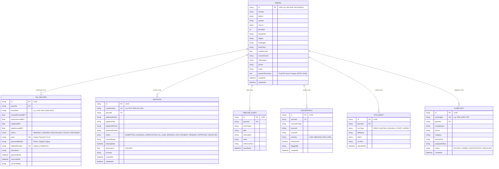

---

## 15. Automated Event Workflows & n8n CDC Integration

Located in `n8n-workflows/payment_reconciliation.json`, the platform integrates an event-driven automation pipeline running on port `5678`:

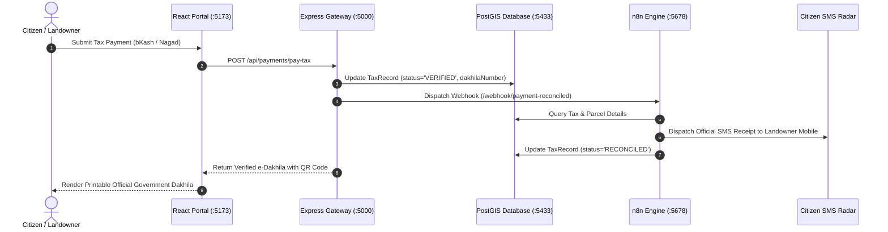

---

## 16. Cadastral "Mouza Sheet" Design System & Bilingual Localization

The design system (`frontend/src/index.css`) avoids generic modern templates in favor of a specialized **"Mouza Sheet" Cadastral Drafting Aesthetic**:

### Design System Attributes:
1. **Curated Dual Palettes**:
   - **Field Sheet (Light Theme)**: Replicates archival drafting paper hues (`#FDFBF7` canvas, `#F4EFE6` panels, `#E7DECE` borders) with crisp India ink typography.
   - **Negative Print (Dark Theme)**: Replicates photographic negative blueprint paper (`#0D1117` base, `#161B22` cards, `#30363D` borders) with luminescent cyan and amber surveying accents.
2. **Authoritative Typography**:
   - **Anek Bangla** for Bengali script rendering.
   - **IBM Plex Mono** for coordinates, UPIDs, Dakhila numbers, and financial amounts.
   - **Inter** for clean UI metadata labels.
3. **Ambient Canvas Graticule (`SurveyField.tsx`)**:
   - Background HTML5 canvas rendering a slow-drifting geodetic survey grid with subtle latitude/longitude tick markers and survey station crosses.
4. **Self-Drawing Vector Cadastre (`ParcelPlate.tsx`)**:
   - SVG component that dynamically animates the drawing of parcel boundary lines with survey corner markers and area stamps.
5. **Accessibility & Micro-Animations**:
   - Smooth GSAP stagger transitions with automatic disabling when `prefers-reduced-motion` is detected.
6. **Bilingual Localization (`language.tsx`)**:
   - Comprehensive dictionary covering all UI labels, tabs, legal terms, statutes, and messages in both **Bengali (বাংলা)** and **English**.

---

## 17. Current Platform Capabilities vs. Traditional Government Portals

| Capability / Dimension | Traditional Bangladesh Portals (`land.gov.bd` / `eparcha` / `ldtax`) | This Integrated Platform (ভূমি সেবা iLMIS) |
|---|---|---|
| **Mental Model** | Service-centric & identifier-centric (Fragmented across multiple sites) | **Parcel-centric (One persistent UPID unifies map, tax, title, and court records)** |
| **Cadastral Maps** | Static scanned raster PDFs or disconnected Mouza sheets | **Interactive PostGIS Leaflet vector GIS with BDS 2026 RTK GNSS layers & BTM coordinates** |
| **Title Due Diligence** | Manual physical deed searching across Sub-Registry volumes | **Algorithmic 5-point Title Clearance Audit with instant scoring & Ed25519 signed certificate** |
| **Deed Forgery Detection** | Discovered only after fraudulent mutation or court suit | **Algorithmic Deed Forensics detecting area inflation, deceased vendors, and broken Baya chains** |
| **Land Buy/Sell Transactions** | Unsecured cash transactions with high risk of double-selling | **9-Stage Zero-Trust Buy/Sell Escrow holding funds until deed execution and mutation approval** |
| **Inheritance & Succession** | Manual calculation prone to disputes and unequal shares | **Authoritative Faraiz Engine implementing Hanafi Sunni and Dayabhaga Hindu succession rules** |
| **Government Khas Defense** | Often encroached without immediate detection | **Proximity radar screening parcels against 1-No Khas, Vested, and riverbed foreshore lands** |
| **Civil Court Dispute Check** | Citizens unaware of injunctions until served by police | **Integrated Litigation Radar checking active stay orders and Lis Pendens under Sec 52 TP Act** |
| **Remote Field Surveying** | Paper field notes prone to loss and manual transfer errors | **Offline Amin GNSS Survey Suite capturing station pegs and neighbor objections with queue sync** |
| **Historical Boundary Shifts** | Unchecked boundary encroachment over decades | **4D Drone Cadastre comparing CS 1924, RS 1988, BS 2015, and BDS 2026 vectors for canal drift** |
| **AI Citizen Assistance** | Static FAQ pages or busy call-center hotline | **Bhumi Sahayak AI Assistant with Gemini models + sovereign offline legal knowledge engine** |
| **Anti-Fraud Record Lock** | None (Citizens have no direct control over records) | **Citizen-controlled biometric Land Lock freezing property against unauthorized transfers** |
| **System Resilience** | Fails when central database or server is offline | **Dual-mode architecture with seamless zero-crash offline demo dataset fallback** |

---

*Authored for the National LandTech Modernization Initiative & R&D Innovation Challenge — Ministry of Land & Directorate of Land Records and Surveys (DLRS), Government of the People's Republic of Bangladesh.*
