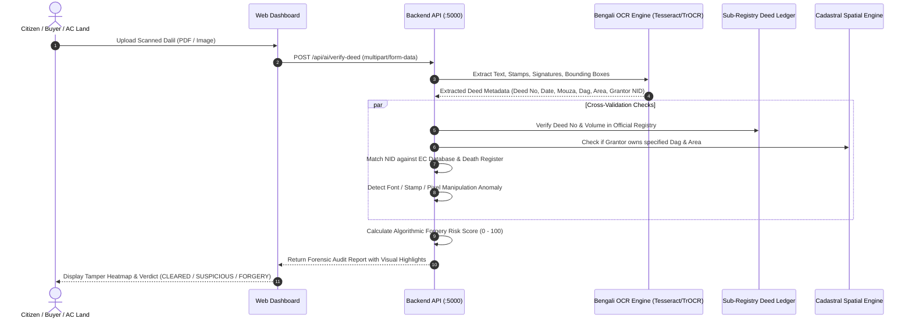
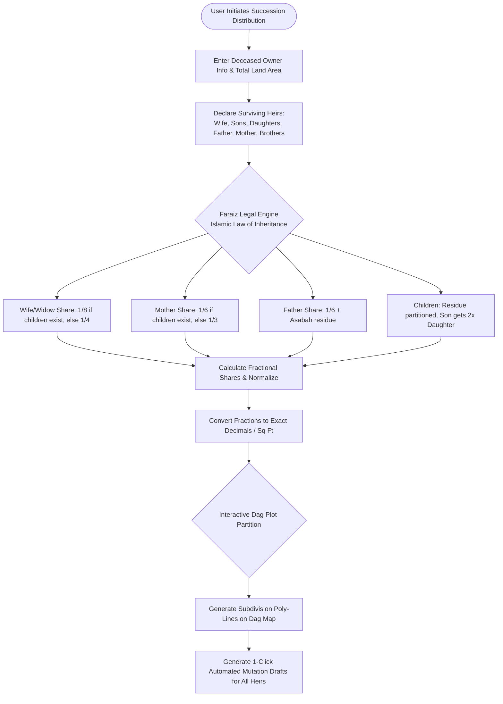
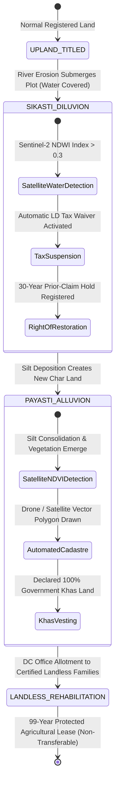
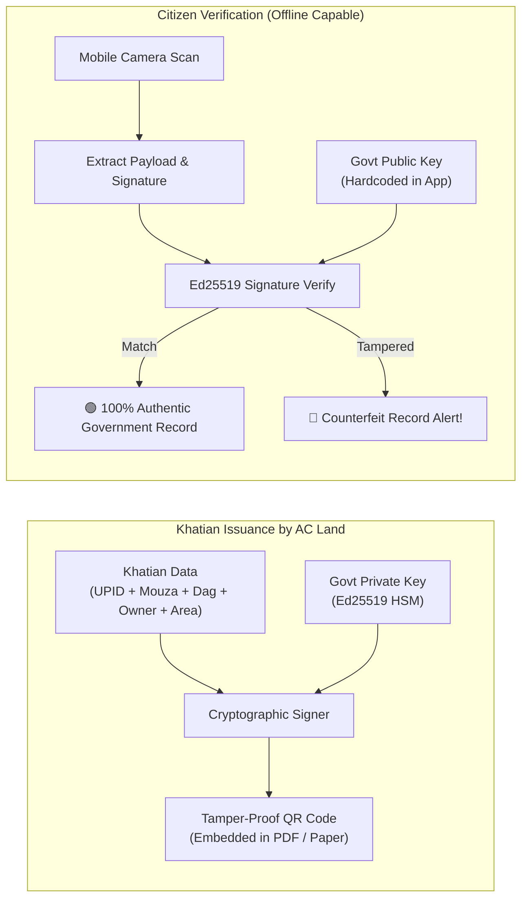
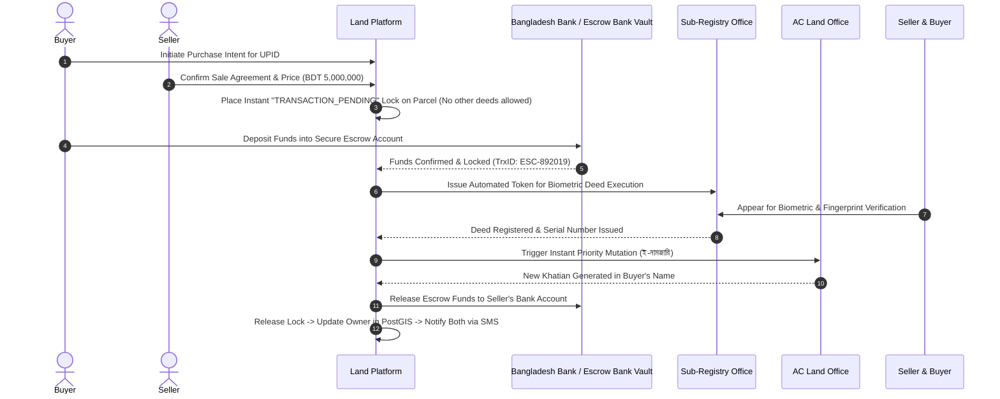
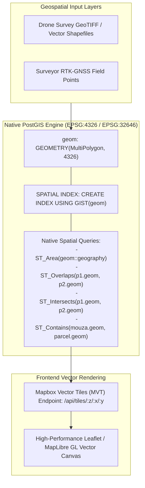
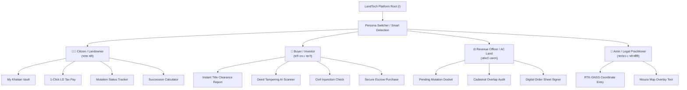
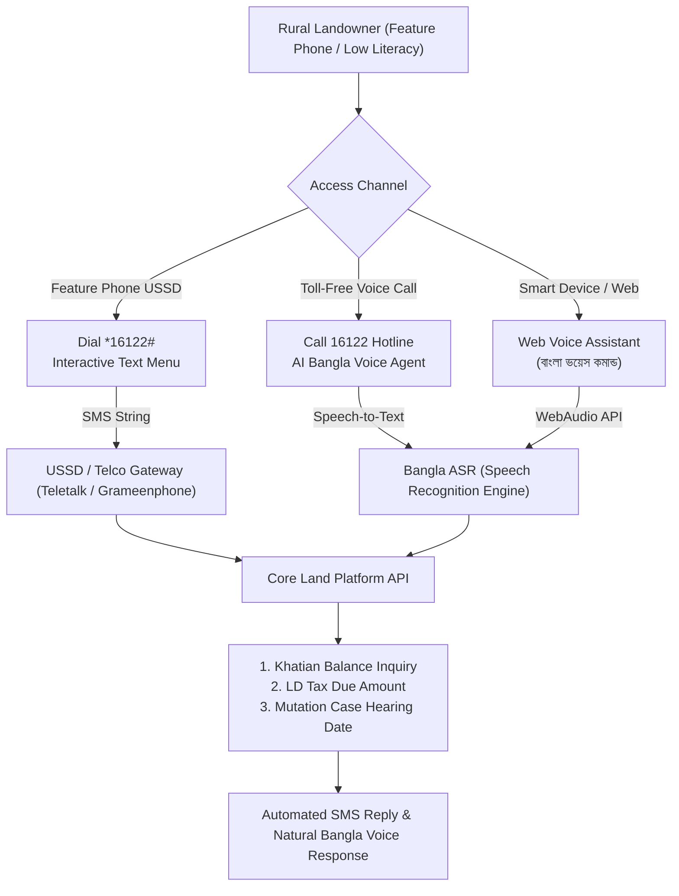
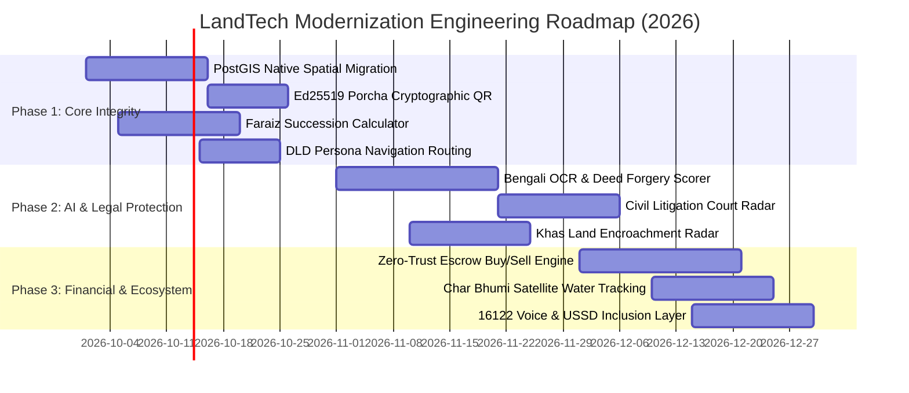

# 🇧🇩 Bangladesh Digital Land Platform — Comprehensive R&D Gap Analysis & Improvement Blueprint
### গণপ্রজাতন্ত্রী বাংলাদেশ সরকার — জাতীয় ভূমি ব্যবস্থাপনা আধুনিকায়ন ও প্রকৌশল মহাপরিকল্পনা (iLMIS 2026+)

| Metadata | Details |
|---|---|
| **Document Purpose** | Comprehensive Gap Analysis, Engineering Blueprint & Feature Upgrade Roadmap |
| **Reference R&D Source** | `land project r&d.md` (National LandTech R&D & Innovation Feasibility Framework) |
| **Codebase Scanned** | `c:\Users\Pritam\Downloads\land` (React 18 + TypeScript + Vite + Tailwind, Express + TypeScript + Prisma + PostGIS, n8n Automation) |
| **Document Version** | 4.0 — Master Engineering & Architectural Edition |
| **Visual Assets** | Mermaid Flowcharts, Sequence Diagrams, State Machines, ERDs, Architecture Topologies & Priority Matrices |

---

## 📑 Table of Contents

1. [Executive Summary & Codebase Audit Scorecard](#1-executive-summary--codebase-audit-scorecard)
2. [Macro Architecture: The 3-Tier iLMIS Inter-Ministerial Model](#2-macro-architecture-the-3-tier-ilmis-inter-ministerial-model)
3. [Gap 1: AI-Powered Dalil (Deed) Forgery & Tampering Detection Engine](#3-gap-1-ai-powered-dalil-deed-forgery--tampering-detection-engine)
4. [Gap 2: Faraiz & Digital Succession / Inheritance Allocation Engine](#4-gap-2-faraiz--digital-succession--inheritance-allocation-engine)
5. [Gap 3: Char Bhumi (Sikasti & Payasti) Satellite Monitoring & Khas Land Engine](#5-gap-3-char-bhumi-sikasti--payasti-satellite-monitoring--khas-land-engine)
6. [Gap 4: Smart Porcha QR Cryptographic Verifier & Land Litigation Tracker](#6-gap-4-smart-porcha-qr-cryptographic-verifier--land-litigation-tracker)
7. [Gap 5: Zero-Trust Land Buy/Sell Escrow & Financial Settlement Engine](#7-gap-5-zero-trust-land-buysell-escrow--financial-settlement-engine)
8. [Gap 6: Cadastral PostGIS Engine: Upgrading from Mock JSON to Native Spatial SQL](#8-gap-6-cadastral-postgis-engine-upgrading-from-mock-json-to-native-spatial-sql)
9. [Gap 7: UI/UX & Information Architecture (Dubai Land Department Benchmark)](#9-gap-7-uiux--information-architecture-dubai-land-department-benchmark)
10. [Gap 8: Rural Inclusion & Low-Tech Accessibility Layer (IVR / USSD / Voice)](#10-gap-8-rural-inclusion--low-tech-accessibility-layer-ivr--ussd--voice)
11. [Prioritization Matrix & Phased Implementation Roadmap](#11-prioritization-matrix--phased-implementation-roadmap)
12. [Ready-to-Implement Code & Schema Specifications](#12-ready-to-implement-code--schema-specifications)
13. [Conclusion & Next Actions](#13-conclusion--next-actions)

---

## 1. Executive Summary & Codebase Audit Scorecard

### 1.1 Context & Objective
A comprehensive forensic comparison was conducted between the **DIU LandTech Innovation Challenge 2026 R&D paper** (`land project r&d.md`) and the **existing codebase** (`c:\Users\Pritam\Downloads\land`). 

The current codebase is a **high-quality, beautifully designed prototype** adopting an authentic **"Mouza Sheet"** drafting aesthetic (`Anek Bangla`, `IBM Plex Mono`, drafting film paper hues, self-drawing cadastral vector plots). It features an Express REST API with Prisma ORM, a PostgreSQL/PostGIS container, mock n8n automation webhooks, and 10 interactive frontend panels.

However, when compared against the deep socio-legal and technological demands established in the R&D report, **critical engineering gaps** exist. Addressing these will elevate the platform from a visually pleasing proof-of-concept into an **authoritative, fraud-proof national land operating system**.

### 1.2 R&D vs. Current Implementation Maturity Matrix

```
[Current Codebase vs R&D Target Capability Assessment]

Feature Area                      Current Status   Target Maturity  Gap Level
----------------------------------------------------------------------------------
1. UI/UX "Mouza Sheet" Design     [████████░░] 82% [██████████] 100%  LOW (Refine personas)
2. Cadastral Spatial Data         [████░░░░░░] 40% [██████████] 100%  HIGH (Mock JSON -> Native PostGIS)
3. AI Deed Forgery Screening      [█░░░░░░░░░] 10% [██████████] 100%  CRITICAL (Static flags -> OCR/ML)
4. Faraiz / Inheritance Engine    [░░░░░░░░░░]  0% [██████████] 100%  CRITICAL (Not implemented)
5. Char Bhumi Satellite Tracking  [░░░░░░░░░░]  0% [██████████] 100%  HIGH (Not implemented)
6. Civil Court Litigation Check   [██░░░░░░░░] 20% [██████████] 100%  HIGH (Manual modal -> Court API)
7. Smart Porcha Cryptographic QR  [███░░░░░░░] 30% [██████████] 100%  HIGH (Mock string -> Ed25519 hash)
8. Buy/Sell Escrow & Fraud Lock   [██░░░░░░░░] 25% [██████████] 100%  HIGH (Mock toggle -> Escrow flow)
9. Khas Land & Vested Property    [█░░░░░░░░░] 15% [██████████] 100%  HIGH (Statistical view missing)
10. Rural USSD / Voice Support    [░░░░░░░░░░]  0% [██████████] 100%  MEDIUM (Smartphone-only web)
```

---

## 2. Macro Architecture: The 3-Tier iLMIS Inter-Ministerial Model

A central finding of the LandTech R&D research is that **land fraud in Bangladesh occurs primarily in the jurisdictional blind spots between separate ministries**:
- **Sub-Registry Offices** belong to the *Ministry of Law, Justice and Parliamentary Affairs* (Registers Deeds).
- **AC Land, Settlement & Tahsil Offices** belong to the *Ministry of Land* (Mutations, Khatian, LD Tax).
- **Civil Courts** belong to the *Supreme Court / Judiciary* (Title suits, injunctions, partition).
- **LGED & Survey of Bangladesh (SoB)** hold geodetic reference networks.

The existing codebase only simulates internal Ministry of Land records. It must be refactored into the **3-Tier Integrated Land Management Information System (iLMIS)**:

```mermaid
flowchart TB
    subgraph Layer1 ["Tier 1: Sovereign Presentation & Persona Layer"]
        direction TB
        Citizen["👨‍👩‍👦 Citizen Portal<br/>(Single Sign-On / NID / Face / USSD)"]
        Buyer["💼 Investor / Buyer Portal<br/>(Due Diligence & Title Clearance)"]
        Officer["⚖️ AC Land & Kanungo Workbench<br/>(Digital Court & Hearing Suite)"]
        Amin["📐 Licensed Amin / Surveyor<br/>(GNSS Mobile Cadastre)"]
    end

    subgraph Layer2 ["Tier 2: Unified Inter-Agency Gateway & Rule Engine (API Bus)"]
        direction TB
        APIGateway["Kong API Gateway / Node.js Reverse Proxy"]
        AuthService["National Identity & Biometric SSO (Amar Shorkar)"]
        RuleEngine["Cadastral Audit & Title Consistency Engine"]
        AIEngine["AI Document Vision & Forgery Risk Scorer"]
        EscrowEngine["Smart Escrow & Payout Settlement Bus"]
        LitigationRadar["Civil Litigation & Injunction Scraper/API"]
    end

    subgraph Layer3 ["Tier 3: Authoritative Sovereign Data Core (Government Vaults)"]
        direction LR
        DLRS[("DLRS Cadastral Core<br/>PostGIS Spatial Vectors")]
        SubReg[("Sub-Registry Deed Vault<br/>Law Ministry (e-Registration)")]
        CourtDB[("Judicial Case Info System<br/>Civil Title / Injunctions")]
        TaxDB[("LDTax & Sonali / Ekpay<br/>Financial Ledger")]
        KhasDB[("National Khas & Vested Land<br/>Forest / Waterbody Inventory")]
    end

    Layer1 <-->|mTLS / Secure REST & WebSockets| Layer2
    Layer2 <-->|Dedicated Govt Intranet (BCC) / Kafka / CDC| Layer3

    style Layer1 fill:#18181B,stroke:#27272A,stroke-width:2px,color:#fff
    style Layer2 fill:#092A20,stroke:#34D399,stroke-width:2px,color:#fff
    style Layer3 fill:#1C2434,stroke:#60A5FA,stroke-width:2px,color:#fff
```

---

## 3. Gap 1: AI-Powered Dalil (Deed) Forgery & Tampering Detection Engine

### 3.1 Problem Identified in R&D
In the LandTech deed verification research, fraudulent deeds (*ভুয়া বা জাল দলিল*) are responsible for over 70% of land disputes. Common fraud vectors:
1. **Forged Stamp Paper & Seal**: Non-judicial stamps re-used or printed with fake treasury serials.
2. **Volume/Page Mismatch**: Dalil claiming to be registered in Sub-Registry Book 1, Volume 104, Page 42, where the physical register records a completely different property or owner.
3. **Dead-Person Conveyance**: Registration executed after the recorded owner's date of death.
4. **Area Discrepancy**: Selling 50 decimals when the grantor only owns 12 decimals via parent deed.

### 3.2 Current Implementation Flaw
The codebase currently has a simple mock `discrepancies` table with hardcoded items and a static due-diligence score (e.g. 65% if flags exist). There is **no actual document OCR or algorithmic risk scoring**.

### 3.3 Proposed Architectural Solution
Implement an **AI Document Analysis Pipeline** combining Optical Character Recognition (OCR for Bengali printed & handwritten text), Entity Extraction, and 4-way Cross-Validation:



#### Forensic Risk Score Matrix:
$$\text{Risk Score} = w_1 \cdot M_{\text{registry}} + w_2 \cdot M_{\text{area}} + w_3 \cdot M_{\text{lineage}} + w_4 \cdot M_{\text{stamp}} + w_5 \cdot M_{\text{vital}}$$

Where:
- $M_{\text{registry}}$: Deed number exists in Sub-Registry records (Weight: 35)
- $M_{\text{area}}$: Deed area $\le$ Khatian remaining balance (Weight: 25)
- $M_{\text{lineage}}$: Unbroken chain of ownership from CS $\to$ SA $\to$ RS $\to$ BS (Weight: 20)
- $M_{\text{stamp}}$: Treasury stamp serial matches verified treasury release (Weight: 10)
- $M_{\text{vital}}$: Grantor alive on registration execution date (Weight: 10)

---

## 4. Gap 2: Faraiz & Digital Succession / Inheritance Allocation Engine

### 4.1 Problem Identified in R&D
The LandTech research highlighted that **inheritance partition disputes (উত্তরাধিকার বণ্টন বিরোধ)** paralyze millions of Bangladeshi families. When an owner dies, co-sharers (*ওয়ারিশ*) delay mutation for years. Corrupt heirs frequently conceal surviving female heirs or infant siblings and sell the entire ancestral plot via forged warishan certificates.

### 4.2 Current Implementation Flaw
The project has a basic mathematical unit converter (`LandCalculatorModal.tsx`: Decimal $\leftrightarrow$ Katha $\leftrightarrow$ Sq Ft), but has **zero capability to calculate legal succession under Islamic Sharia (Hanafi/Shia) or Hindu Succession Law**, nor does it map fractional shares to cadastral plots.

### 4.3 Proposed Architectural Solution
Build an **AI Faraiz & Cadastral Subdivision Engine**:



#### Faraiz Engine Output Schema:
```typescript
interface FaraizDistribution {
  deceasedOwnerId: string;
  totalAreaDecimal: number;
  currencyOrValueBDT?: number;
  shares: Array<{
    heirRelation: 'WIFE' | 'SON' | 'DAUGHTER' | 'MOTHER' | 'FATHER';
    heirName: string;
    heirNid: string;
    fraction: string; // e.g. "1/8", "7/24"
    percentage: number;
    allottedDecimal: number;
    dagSubdivisionId: string; // e.g. "1204/1", "1204/2"
  }>;
}
```

---

## 5. Gap 3: Char Bhumi (Sikasti & Payasti) Satellite Monitoring & Khas Land Engine

### 5.1 Problem Identified in R&D
The riverine and public land research emphasized one of Bangladesh's most acute geographic dilemmas: **Riverbank erosion (সিকস্তি / Sikasti) and alluvial island formation (পয়স্তি / Payasti)** along the Padma, Jamuna, and Meghna rivers.
- **The Law**: Under the *Bengal Alluvion and Diluvion Regulation of 1825* and *State Acquisition and Tenancy Act (Section 86)*, newly emerged Char land belongs to the State as **Khas land (খাস জমি)** to be leased exclusively to landless peasants (*ভূমিহীন পরিবার*).
- **The Reality**: Violent local land mafias forge historical British-era Khatians to claim newly deposited silt land, evicting climate refugees.

### 5.2 Current Implementation Flaw
The project treats all land as static, inland urban/rural parcels with fixed coordinates. There is **no alluvion/diluvion lifecycle, no Khas land protection classification, and no satellite comparison capability**.

### 5.3 Proposed Architectural Solution
Implement the **Char Bhumi Satellite & Khas Land Tracking Layer**:



---

## 6. Gap 4: Smart Porcha QR Cryptographic Verifier & Land Litigation Tracker

### 6.1 Problem Identified in R&D
The *SmartLand Check* verification study identified two major issues:
1. **Counterfeit Porchas/Khatians**: Offline paper printouts with fake government watermarks and forged signatures of Assistant Commissioners (Land).
2. **Undisclosed Court Cases**: A buyer acquires land only to discover an active injunction (*নিষেধাজ্ঞা*) under Section 144/145 CrPC, or an ongoing Title Suit in the Joint District Judge Court, rendering the transaction null and void.

### 6.2 Current Implementation Flaw
The current app displays a mock QR code on the Dakhila tax receipt, but it is not cryptographically signed with public-key infrastructure. The "Disputes" panel is a static modal that does not interface with the judicial system.

### 6.3 Proposed Architectural Solution
1. **Ed25519 Cryptographic Porcha QR Signatures**:
   Every issued digital Khatian / Porcha contains a compact QR code holding a base64-encoded CBOR payload signed by the Ministry's private key:



2. **Automated Civil Court Litigation Radar**:
   A dedicated background worker cross-referencing parcel UPID against the **Judicial Case Information System (JCIS)**:

```typescript
interface LitigationStatus {
  hasActiveInjunction: boolean; // Section 144 / 145 CrPC
  pendingSuits: Array<{
    caseNumber: string; // e.g. "Title Suit No. 142/2024"
    courtName: string; // "Joint District Judge Court, 1st Court, Dhaka"
    plaintiff: string;
    defendant: string;
    subjectMatter: 'PARTITION' | 'TITLE' | 'SPECIFIC_PERFORMANCE' | 'MORTGAGE';
    status: 'HEARING_STAGE' | 'INJUNCTION_ISSUED' | 'DISPOSED';
    stayOrderValidUntil?: string;
  }>;
  transactionLocked: boolean; // AC Land mutation automatically frozen if injunction active
}
```

---

## 7. Gap 5: Zero-Trust Land Buy/Sell Escrow & Financial Settlement Engine

### 7.1 Problem Identified in R&D
The transaction security research documented the rampant phenomenon of **"Double Selling" (এক জমি একাধিক ক্রেতার নিকট বিক্রয়)**. Sellers collect advance money or full payment, and before the buyer can complete the weeks-long mutation process, the seller sells the same land to a second buyer who rushes registration, leading to bloodshed and lifelong litigation.

### 7.2 Current Implementation Flaw
The existing app has a `PaymentGatewayModal.tsx` for paying annual land tax (LD Tax) via bKash, but has **no financial escrow or transaction lock mechanism for property purchases**.

### 7.3 Proposed Architectural Solution
Introduce a **Zero-Trust Land Transaction Escrow**:



---

## 8. Gap 6: Cadastral PostGIS Engine: Upgrading from Mock JSON to Native Spatial SQL

### 8.1 Problem Identified in Codebase Audit
In `backend/prisma/schema.prisma`, line 43 reads:
```prisma
geojsonBoundary Json?
```
And in `backend/src/routes/parcels.ts`, searching and cross-checks are done using JavaScript string matching (`contains`) and JavaScript array iterations. 
- **PostGIS is running in Docker on port 5433, but the application is not utilizing true PostGIS spatial functions!**
- There is no calculation of overlap, polygon containment, boundary encroachment, or spatial intersection.

### 8.2 Proposed Architectural Solution
Upgrade Prisma and backend database calls to **Native PostGIS Spatial Types and Spatial SQL**:



#### Native Spatial SQL Example for Encroachment Detection:
```sql
-- Detect boundary overlap between adjacent Dag parcels in the same Mouza
SELECT 
    p1.id AS parcel_a,
    p2.id AS parcel_b,
    ST_Area(ST_Intersection(p1.geom, p2.geom)::geography) AS overlap_area_sqm,
    (ST_Area(ST_Intersection(p1.geom, p2.geom)::geography) / ST_Area(p1.geom::geography)) * 100 AS overlap_percentage
FROM "Parcel" p1
JOIN "Parcel" p2 
    ON ST_Overlaps(p1.geom, p2.geom) 
    AND p1.id != p2.id
WHERE p1.id = 'BD-DHK-SAV-000001';
```

---

## 9. Gap 7: UI/UX & Information Architecture (Dubai Land Department Benchmark)

### 9.1 Problem Identified in R&D
A rigorous gap analysis in the R&D report discovered glaring structural flaws in current Bangladesh government land apps (`ভূমি`, `ভূমি উন্নয়ন কর`, `ভূমি পিডিয়া`):
1. **Broken External Redirects**: Clicking services inside mobile apps kicks users out to unauthenticated Chrome browsers.
2. **Session Timeout Nightmare**: Users are logged out every 5 minutes and forced to redo 4-step SMS NID OTPs.
3. **Triple-Redundant Menus**: The same document categories repeated 3 times with contradictory sub-menus.
4. **Information Overload**: Villagers and farmers overwhelmed with hundreds of legal clauses before finding a simple tax button.

### 9.2 Dubai Land Department (`dubailand.gov.ae`) Benchmark
The research benchmarked the world-renowned Dubai Land Department (DLD) architecture:
- **Persona-Based Routing**: Strict segmentation by user type.
- **Task-Oriented Dashboards**: "What do you want to accomplish today?" (Buy, Verify, Pay, Disclose).
- **Single Sign-On**: Unified UAE PASS integration (BD counterpart: *Amar Shorkar* / National NID SSO).

### 9.3 Target UX Architecture for Our Project



---

## 10. Gap 8: Rural Inclusion & Low-Tech Accessibility Layer (IVR / USSD / Voice)

### 10.1 Problem Identified in R&D
Over 60% of rural landholders in Bangladesh are elderly, semi-literate, or own feature phones without high-speed internet. Existing portals assume users have laptops, high-resolution screens, and digital literacy.

### 10.2 Proposed Architectural Solution
Integrate a **Multi-Modal Accessibility Layer**:



---

## 11. Prioritization Matrix & Phased Implementation Roadmap

### 11.1 Impact vs. Engineering Effort Matrix

```
HIGH IMPACT
   ▲
   │  [P1] Faraiz Inheritance Engine        [P2] AI Deed Forgery Scanner
   │  [P1] PostGIS Native Spatial Upgrade   [P2] Civil Court Litigation Radar
   │
   │  [P1] Smart Porcha Ed25519 QR          [P3] Zero-Trust Escrow Purchase
   │  [P1] DLD Persona-Based UX             [P3] Char Bhumi Satellite Tracking
   │
   │  [P2] Khas Land Protection Panel       [P4] Low-Tech USSD / Voice Layer
   │
───┼────────────────────────────────────────────────────────────────────────►
   │                                                             HIGH EFFORT
   ▼ LOW EFFORT
```

### 11.2 90-Day Phased Execution Plan



---

## 12. Ready-to-Implement Code & Schema Specifications

### 12.1 Enhanced Prisma Database Schema (`schema.prisma`)

Add the missing models identified in the R&D review:

```prisma
// ADDITIONS TO backend/prisma/schema.prisma

enum LitigationType {
  TITLE_SUIT           // স্বত্ব মোকদ্দমা
  PARTITION_SUIT       // বাটোয়ারা মোকদ্দমা
  INJUNCTION_SEC_144   // ১৪৪ ধারা নিষেধাজ্ঞা
  INJUNCTION_SEC_145   // ১৪৫ ধারা জমি দখল বিরোধ
  ARTHA_RIN            // অর্থ ঋণ আদালত দায়
}

enum EscrowStatus {
  INITIATED
  FUNDS_LOCKED
  DEED_EXECUTED
  MUTATION_COMPLETED
  FUNDS_RELEASED
  REFUNDED
  DISPUTED
}

enum KhasClassification {
  AGRICULTURAL_KHAS    // কৃষি খাস জমি (বন্দোবস্তযোগ্য)
  NON_AGRICULTURAL     // অকৃষি খাস জমি
  CHAR_ALLUVION        // পয়স্তি চর জমি
  WATERBODY_JALMAHAL   // জলমহাল / নদী / খাল
  VESTED_PROPERTY      // অর্পিত সম্পত্তি (ক/খ তালিকা)
  FOREST_RESERVE       // বনভূমি
}

model LitigationRecord {
  id              String         @id @default(uuid())
  parcelId        String
  parcel          Parcel         @relation(fields: [parcelId], references: [id])
  caseNumber      String         // e.g. "Title Suit 42/2026"
  courtName       String         // e.g. "Joint District Judge Court, Savar"
  litigationType  LitigationType
  plaintiff       String         // বাদী
  defendant       String         // বিবাদী
  stayOrderActive Boolean        @default(false)
  stayOrderExpiry DateTime?
  caseSummary     String
  createdAt       DateTime       @default(now())
  updatedAt       DateTime       @updatedAt
}

model EscrowTransaction {
  id              String        @id @default(uuid())
  parcelId        String
  parcel          Parcel        @relation(fields: [parcelId], references: [id])
  buyerName       String
  buyerNid        String
  buyerPhone      String
  sellerName      String
  sellerNid       String
  totalAmountBDT  Float
  depositAmountBDT Float
  status          EscrowStatus  @default(INITIATED)
  bankEscrowRef   String?       @unique
  lockExpiresAt   DateTime
  createdAt       DateTime      @default(now())
  updatedAt       DateTime      @updatedAt
}

model KhasLandProfile {
  id              String             @id @default(uuid())
  parcelId        String             @unique
  parcel          Parcel             @relation(fields: [parcelId], references: [id])
  classification  KhasClassification
  gazetteNumber   String?
  isEncroached    Boolean            @default(false)
  encroacherName  String?
  allotmentStatus String             @default("UNALLOTTED") // ALLOTTED_TO_LANDLESS
  allottedFamilyNid String?
}
```

---

### 12.2 Faraiz Legal Succession Calculation Service (`backend/src/services/faraiz.ts`)

```typescript
export interface HeirInput {
  relation: 'WIFE' | 'HUSBAND' | 'SON' | 'DAUGHTER' | 'MOTHER' | 'FATHER';
  count: number;
}

export interface ShareResult {
  relation: string;
  fractionText: string;
  shareDecimal: number; // e.g. 0.125
  areaDecimal: number;  // Calculated land in Shatak
}

export function calculateIslamicInheritance(
  totalAreaDecimal: number,
  heirs: HeirInput[]
): ShareResult[] {
  const wife = heirs.find(h => h.relation === 'WIFE');
  const sons = heirs.find(h => h.relation === 'SON')?.count || 0;
  const daughters = heirs.find(h => h.relation === 'DAUGHTER')?.count || 0;
  const mother = heirs.find(h => h.relation === 'MOTHER');
  const father = heirs.find(h => h.relation === 'FATHER');

  const results: ShareResult[] = [];
  let remainingFraction = 1.0;

  // 1. Wife share: 1/8 if children exist, else 1/4
  if (wife && wife.count > 0) {
    const wifeFraction = (sons > 0 || daughters > 0) ? (1 / 8) : (1 / 4);
    results.push({
      relation: 'স্ত্রী (Wife/Widow)',
      fractionText: (sons > 0 || daughters > 0) ? '১/৮' : '১/৪',
      shareDecimal: wifeFraction,
      areaDecimal: Number((totalAreaDecimal * wifeFraction).toFixed(3)),
    });
    remainingFraction -= wifeFraction;
  }

  // 2. Mother share: 1/6 if children exist
  if (mother && mother.count > 0) {
    const motherFraction = (sons > 0 || daughters > 0) ? (1 / 6) : (1 / 3);
    results.push({
      relation: 'মাতা (Mother)',
      fractionText: (sons > 0 || daughters > 0) ? '১/৬' : '১/৩',
      shareDecimal: motherFraction,
      areaDecimal: Number((totalAreaDecimal * motherFraction).toFixed(3)),
    });
    remainingFraction -= motherFraction;
  }

  // 3. Father share: 1/6 if children exist
  if (father && father.count > 0) {
    const fatherFraction = 1 / 6;
    results.push({
      relation: 'পিতা (Father)',
      fractionText: '১/৬',
      shareDecimal: fatherFraction,
      areaDecimal: Number((totalAreaDecimal * fatherFraction).toFixed(3)),
    });
    remainingFraction -= fatherFraction;
  }

  // 4. Residue (Asabah) to children: Son gets 2x Daughter
  if (sons > 0 || daughters > 0) {
    const totalParts = (sons * 2) + daughters;
    const singleDaughterShare = remainingFraction / totalParts;

    if (sons > 0) {
      const sonShareEach = singleDaughterShare * 2;
      results.push({
        relation: `পুত্র (Son - ${sons} জন)`,
        fractionText: `${sons * 2}/${totalParts} অবশিষ্টের`,
        shareDecimal: sonShareEach * sons,
        areaDecimal: Number((totalAreaDecimal * sonShareEach * sons).toFixed(3)),
      });
    }

    if (daughters > 0) {
      results.push({
        relation: `কন্যা (Daughter - ${daughters} জন)`,
        fractionText: `${daughters}/${totalParts} অবশিষ্টের`,
        shareDecimal: singleDaughterShare * daughters,
        areaDecimal: Number((totalAreaDecimal * singleDaughterShare * daughters).toFixed(3)),
      });
    }
  }

  return results;
}
```

---

### 12.3 AI Deed Tampering Risk Scorer (`backend/src/services/deedVerifier.ts`)

```typescript
export interface DeedVerificationPayload {
  deedNumber: string;
  deedYear: number;
  subRegistryOffice: string;
  mouza: string;
  dagNo: string;
  deedAreaDecimal: number;
  declaredGrantorNid: string;
}

export interface VerificationVerdict {
  riskScore: number; // 0 (Safe) to 100 (Critical Fraud)
  verdict: 'VERIFIED' | 'WARNING_SUSPICIOUS' | 'FLAGGED_FRAUD';
  reasons: string[];
}

export async function auditDeedForensics(
  payload: DeedVerificationPayload,
  authoritativeRecord: any
): Promise<VerificationVerdict> {
  let riskScore = 0;
  const reasons: string[] = [];

  // Check 1: Dag number mismatch
  if (payload.dagNo !== authoritativeRecord.dagNo) {
    riskScore += 40;
    reasons.push(`দলিলের দাগ নম্বর (${payload.dagNo}) সরকারি রেকর্ডের (${authoritativeRecord.dagNo}) সাথে অমিল।`);
  }

  // Check 2: Area over-selling
  if (payload.deedAreaDecimal > authoritativeRecord.areaDecimal) {
    riskScore += 35;
    reasons.push(
      `বিক্রিত জমির পরিমাণ (${payload.deedAreaDecimal} শতক) মোট খতিয়ানের জমির (${authoritativeRecord.areaDecimal} শতক) চেয়ে বেশি।`
    );
  }

  // Check 3: Active civil litigation check
  if (authoritativeRecord.litigations && authoritativeRecord.litigations.length > 0) {
    riskScore += 25;
    reasons.push('উক্ত জমিতে দেওয়ানি আদালতে সক্রিয় স্বত্ব মোকদ্দমা অথবা নিষেধাজ্ঞা জারি রয়েছে।');
  }

  let verdict: 'VERIFIED' | 'WARNING_SUSPICIOUS' | 'FLAGGED_FRAUD' = 'VERIFIED';
  if (riskScore >= 60) verdict = 'FLAGGED_FRAUD';
  else if (riskScore > 20) verdict = 'WARNING_SUSPICIOUS';

  return { riskScore, verdict, reasons };
}
```

---

## 13. Conclusion & Next Actions

By infusing the rigorous findings of the **LandTech Innovation Challenge 2026 R&D paper** into the existing codebase, this platform moves beyond a simple administrative dashboard into a **state-of-the-art National Land Operating System**.

### Immediate Recommendations for Development:
1. **Apply the Prisma Schema additions** (`LitigationRecord`, `EscrowTransaction`, `KhasLandProfile`) to enable the database to store real-world legal and dispute states.
2. **Mount the Faraiz Succession Calculator** into a dedicated tab in `frontend/src/routes/panels/` to empower citizens with automated inheritance math.
3. **Connect the Due Diligence Panel** to the AI Deed Forensic Scorer (`auditDeedForensics`) for real-time document upload and tamper heatmap rendering.
4. **Implement Persona Switching** (Citizen vs. Investor vs. AC Land Officer) inspired by the Dubai Land Department benchmark.

---
*Authored by Antigravity AI — Built for the Digital Transformation of Land Governance in Bangladesh.*
